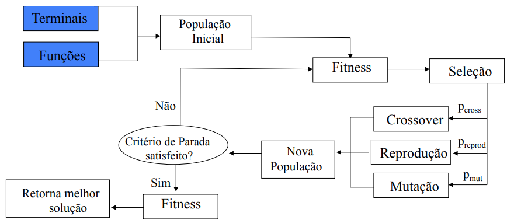
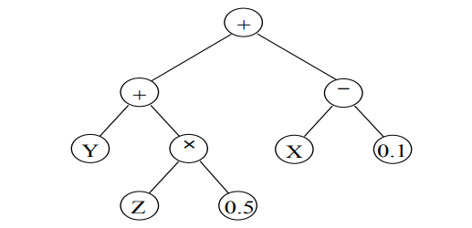
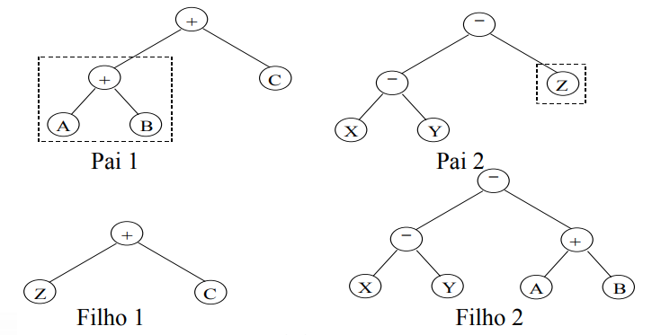
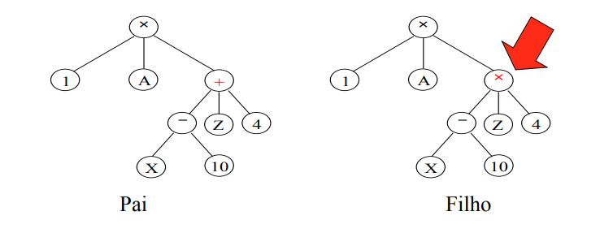
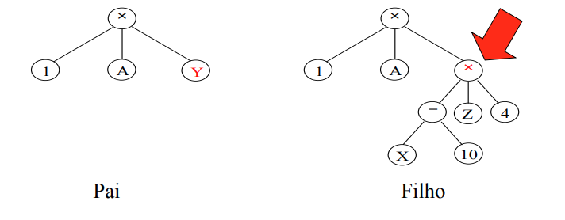
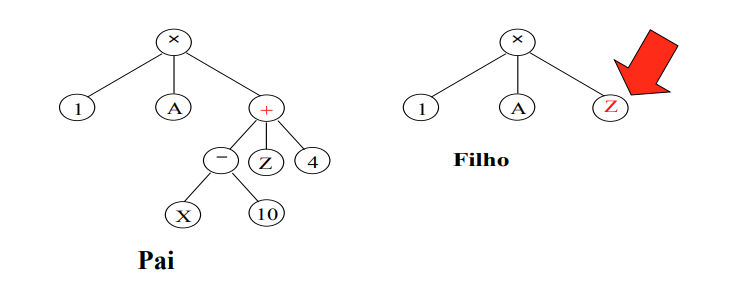

# Programação Genética
## Principais Caracteristicas
- Criada com o abjetivo de evoluir programas

1. Um indivíduo é uma solução candidata
2. Indivíduos tem tamanhos e formas diferentes
3. Na teoria, um indivíduo é uma "receita" para resolver um problema

**Algoritmo Genético x Programação Genética**

Dada uma função complexa **sin(x) - 0.1x + 2**, podemos usar o **Algoritmo Genético** para encontrar o valor ótimo da função, e **Programação Genética** para encontrar um função g(x) que se aproxime da função complexa f(x) usando apenas pares <x, f(x)> (Regressão Simbólica)
________________________________
## Estrutura

Também e um algoritmo evolucionário, então possui essa estrutura bem semelhante aos outros algoritmos evolucionario, com exessão dos "Terminais" e "Funções"

1. Terminais:  constantes e variáveis 
2. Funções: funções apropriadas para resolver o problema em questão

**Representações**

É bem comum usar árvores para representar um indivíduo de GP

- Conjunto de funções: F = {+, -, x}
- Conjunto de terminais: T = {X, Y, Z, 0.1, 0.5}

**Inicialização da População**

Dado um conjunto de funçoes F e um conjunto de terminais T, temos 3 opções para inicializar a população.

1. Grow: Escolher nos aleatoríamente dentro dos conjuntos T e F, considerando apenas uma altura máxima da árvore
   1. Acaba gerando árvores bem irregulares

2. Full: Para produzir a arvores mais completa possível, ele começa selecionando nos apenas do conjunto de funções F até que a profundidade máxima seja alcançada, então ele finaliza a árvores usado nos do conjunto de terminais T
   1. Gera árvores balanceadas

3. Ramped hald-and-half: Combina os métodos **full** e **grow** para aumentar diversidade. Divide a população em subconjuntos de tamanho igual e inicializa metade com cada método
   1. Se a profundidade máxima é 6, e o tamanho da população 50, serão criados um mesmo 5 subconjuntos de 10 indivíduos com profundidades 2, 3, 4, 5 e 6. Metada de cada subconjunto (5 indivíduos) serão iniciados com **grow** e metade com **full**

_______________________________

## Operadores Genéticos

**Crossover**

Por trabalhar com árvoes, o cruzamento é a troca de subárvores

Selecionar aleatoriamente uma subárvores em cada indivíduo e trocar elas

**Mutação**

Temos várias opções:

- Mutação de um ponto: Selecionar um nó e trocar por outro do mesmo conjunto

    

- Mutação de expansão: Selecionar um nó e expandir a árvore

    

- Mutação de redução: Selecionar um nó e cortar a árvore

    

__________________________

## Conjunto de funções

**Representatividade**

O conjunto de funções usadas na árvores devem ser adequadas ao problema. Elas precisam ter algumas propriedades:

1. **Suficiencia**: A expressão é suficiente para representar uma solução candidata para o problema em questão
2. **Fechamento**: Uma função deve aceitar como entrada qualquer outro elemento do conjunto de funções e terminais
3. **Parcimônia**: idealmente, conter apenas funções necessárias para resolver o problemaem questão. (Não necessária, desejada)

**Equilibrio entre Suficiencia e Parcimônia**

Iniciar com FS = {+, -, x, -} ou {OR, AND, XOR}

e ir adicionando quando necessário

**Problemas de fechamento**

Podemos modificar certas funções para funcionar melhor.

- Ex:
  - Divisão por 0 é indefinida, então criamos a divisão protegida (se o denominador for zero, retornar valor padrão)

_______________

## Leitura Recomendada

[A Field Guide to Genetic Programming, Livro online](http://www.gp-field-guide.org.uk/)

[GENETIC PROGRAMMING: EVOLUTION OF MONA LISA](https://rogerjohansson.blog/2008/12/07/genetic-programming-evolution-of-mona-lisa/)