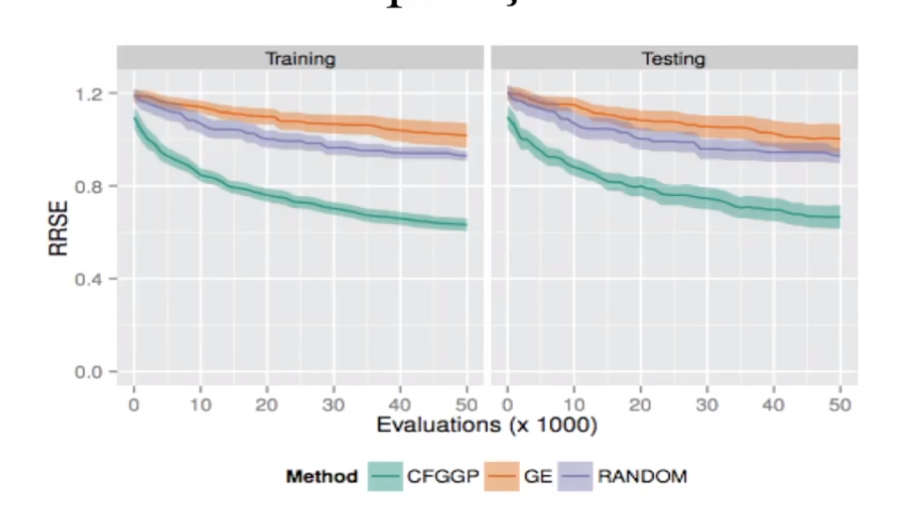

# Programação Genética Baseada em Gramáticas

## Fitness Landscape

Gráfico que ilustra as n dimensões do problema e a qualidade da solução.

## Localidade

Diz respeito ao quanto genótipos próximos representam a fenótipos próximos.

Quando a localidade é alta, uma mudançã pequena no genótico gera uma mudança pequena no fenótipo, e o contrário para a localidade baixa.

A localidade é muito importante para uma busca eficiente no espaço de soluções.

**Influencia da Localidade**

CFGGP é Tipo 1. GE é Tipo 2, gramatical evolution.

Podemos ver que a falta de localidade deixa o método GE pior que a busca aleatória.

## Structed Grammatical Evolution

GE com localidade melhorada.

O Tamanho do cromossomo é igual ao número de não-terminais da gramática.

Cada cromossomo representa uma lista. A lista tem tamanho do número máxido de expansões para o não terminal. Cada posição dessa lista tem um número aleatório de 1 ao número máxido de derivaçãoes

Assim o cruzamento perde o efeito destrutivo e passamos a ter contexto na hora de trocar os cromossomos.

# Duvidas

- No SGE, todos os genótipos possuem o meso tamanho ?
  - SIM! 

