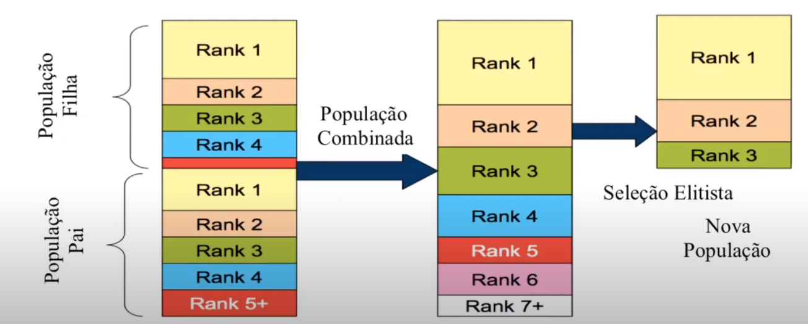
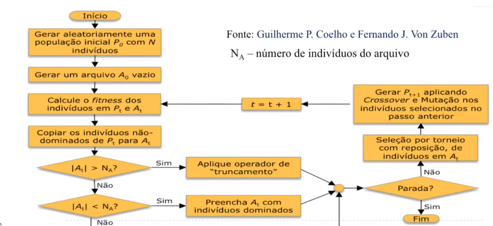

# Algoritmos Evolucionários Multi-objetivos - Parte 2

Algoritmos Eletistas

# NSGA-II

Outra forma de atribuir uma fitness ao indivíduo

Ele divide a população em ranks de dominancia. Rank i domina todos os ranks menores que i.

Quando um rank não cabe na nova população, calculamos a distancia de crowding de cada indivíduo e selecionamos os com maior crowding. (aspecto de diversidade)

# SPEA 2

Trabalha com uma população e um arquivo externo. Esse arquivo guarda todos os indivíduos não dominados únicos.

Queremos minimizar a Fitness $F_{SPEA2}(i) = R(i) + D(i)$

1. R: Proximidade da fronteira de pareto
2. D: Diversidade no Espaço de Objetivos (densidade?)

Cada indivíduo i tem uma força $S$, que é o número de indivíduos que i domina. $R(i)$ é a soma das forças de todos os indivíduos que dominam i.

$D(i) = \frac{1}{\sigma_{i}^{k} + 1}$

onde $\sigma_{i}^{k}$ é a distancia ao k-ensimo vizinho mais próximo no espaço de objetivos

Isso leva a exploração de regioes pouco povoadas.

# MOEA/D

Não é elitista, ele decompoe um problema multiobjetivo em vário de um objetivo só.

é menos custoso e usa heurísticas para otimizar os subproblemas de forma cooperativa.

# Many-Objevtive Problems

métodos com mais de 3 objetivos precisam de algoritmos mais eficientes.

