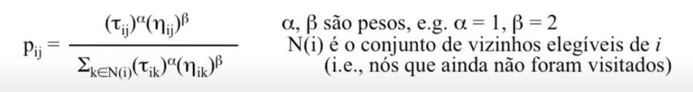

# Colônia de Formigas

Método de busca onde um conjunto de agentes constroem incrimentalmente soluções candidatas para um problema.

Contrução é problabilistica e guiada por:
1. Heurística sobre o problema
2. Memória compartilhaada (Trilha de feromônio)

O problema e modelado como um **grafo**, onde cada **aresta** tem uma quandidade de **feromônio T** e cada formiga pode **ler** ou **escrever** feromônio.

Cada caminho representa uma solução.

A probabilidade da formiga escolher um caminho é proporcional a quantidade de feromônio disponível.

*Desirability* (*N*): Mede a qualidade de cada componente que pode ser adicionado a uma solução. Incorposo informações do problema. Informação **LOCAL**

Regra de transição probabilística: Baseado na *Desirability* e na quantidade de feromônio. Ex: *N* * T

**Escolha de aresta**: Uma formiga na cidade *i* se move para a cidade ainda não visitada *j* com problabilidade:

**Atualização de feromônio**: Feromônio aumenta com a qualidade do caminho. Usa uma mecanismo global e independente do problema.

T*ij* = (1-*p*) * T*ij* + delta(T)

*p* é a taxa de evaporação

delta(T) é a quantidade de feromônio adicionado. Ele pode ser definico como uma função que entrega 1/custo da solução se o nó faz parte da solução, e zero se ele não fizer.

**Métodos de atualização**

1. **Elitista**: Utiliza a melhor solução encontrada até o momento para atualizar o feromônio. Favorece exploitation.

2. **Baseado em Rank**: Solução são rankeadas e o peso de atualização e equivalente a sua colocação.

**Parâmetros**

1. Número máximo de iterações
2. Número de formigas:
   1. Regra do dedão: Igual ao número de arestas do grafo
3. Taxa de feromônio inicial
4. Pesos para concentração de feromônio (alpha) e qualidade da função (beta) quando calculando a probabilidade de transição
5. Taxa de evaporação