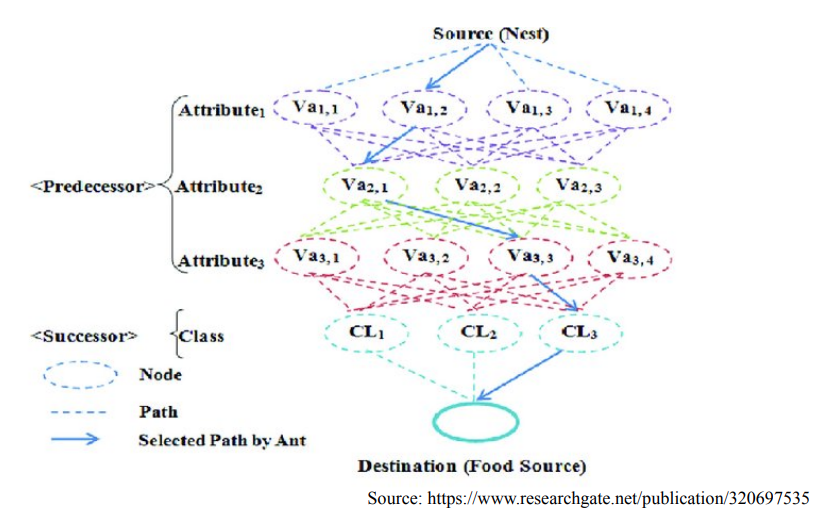

# Aplicações de ACO

[Video](https://www.youtube.com/watch?v=xwpA_PZ4X_U&feature=youtu.be&ab_channel=GiselePappa)
[Slides](https://virtual.ufmg.br/20201/pluginfile.php/676988/mod_resource/content/1/AplicacoesACO.pdf)


- Caixeiro Viajante:
  - Utilizada por empresas de telefonia para rotas de tráfico de ligações telefônicas
- Robótica coletiva
- Mineração de dados


## Ant-Miner

Resolver problemas de mineração de dados.

### Indução de regras de classificação

Uma regra segue o formato:

```
IF <L> then <classe>
```

- `L` é uma lista dwe condições do tipo `<atributo operador valor>`
- `classe` pertence ao conjunto de `k` valores de classes `{c_1, c_2, ..., c_k}`

Ex:

`IF < crédito MAIOR_QUE 100 > faz empréstimo`

### Definição do problema

- Dado: um conjunto de dados de treinamento
- Objetivo: gerar regras de classificação que representem esse conjunto 
- Saída: lista ordenada de regras de classificação

Exemplo de conjunto de treino:

`play` é a classe `classe`

| Outlook   | Temperature | Temperature | Humidity | Humidity | Windy | Play   |
| --------- | ----------- | ----------- | -------- | -------- | ----- | ------ |
| overcast  | 83          | hot         | 86       | high     | FALSE | yes    |
| overcast  | 64          | cool        | 65       | normal   | TRUE  | yes    |
| overcast  | 72          | mild        | 90       | high     | TRUE  | yes    |
| overcast  | 81          | hot         | 75       | normal   | FALSE | yes    |
| rainy     | 70          | mild        | 96       | high     | FALSE | yes    |
| rainy     | 68          | cool        | 80       | normal   | FALSE | yes    |
| rainy     | 65          | cool        | 70       | normal   | TRUE  | no     |
| rainy     | 75          | mild        | 80       | normal   | FALSE | yes    |
| rainy     | 71          | mild        | 91       | high     | TRUE  | no     |
| **sunny** | 85          | hot         | 85       | **high** | FALSE | **no** |
| **sunny** | 80          | hot         | 90       | **high** | TRUE  | **no** |
| **sunny** | 72          | mild        | 95       | **high** | FALSE | **no** |
| sunny     | 69          | cool        | 70       | normal   | FALSE | yes    |
| sunny     | 75          | mild        | 70       | normal   | TRUE  | yes    |


Exemplo de regra:

```
IF (humidity = high) and (outlook = sunny) THEN play = no (3.0/0.0) 
```

Como criar regras

A crianção de uma regra adiciona restrições iterativamente.

A criação de várias regras funciona com a cobertura sequencial:

```
while existirem elementos no conjunto de treino
  - Aprende uma regra que cubra parte dos exemplos
  - Remove os exemplos cobertos pela nova regra
end while
```

**Regras no Antimer**:
- Segue a abordagem de cobertura sequencial
  - Formigas trabalham para gerar uma regra de decisão
  - ACO executado várias vezes (a cada execução um número menor de exemplos é considerado)
- Cada formiga inicialmente representa uma “regra vazia”
- Formigas incrementalmente adicionam um termo (condição) a regra (par atributo+valor) de acordo com uma métrica de entropia e a quantidade de feromônio depositada 



Evitamos Overfit verificando a cobertura de uma regra. Se ela cobre muitos poucos exemplos, então provavelmente estamos overfitando nosso dataset de treino. Isso tambem pode servir como critério de parada

Ao final da iteração, a classe da regra é escolhida de acordo com a classe da maioria dos exemplos cobertos.

Versão inicial só trabalhava com atributos categóricos 

Algoritimo

```
WHILE (No. of cases in the Training set > Max-uncovered allowed)
  i=0;
  REPEAT
    i=i+1
    Anti incrementally constructs a classification rule
    Prune the just constructed rule
    Update the pheromone of the trail followed by Anti
  UNTIL (i ≥ No-of-Ants) or (Anti covers less examples than a predefined threshold)


  Select the best rule among all constructed rules
  Remove the cases correctly covered by the selected rule from the training set
END WHILE
```