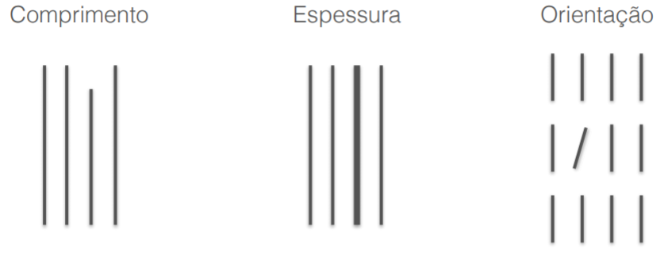

# Motivação e Apresentação do curso

Se popularizou com o crescimento da ciência de dados, mas é uma área bem antiga. Já foram achados visualizações de até 1869, como a campanha de 1812 de Charles Minard.

**O que é visualização de dados**

A Visualização científica e diferente da visualização de dados. Ela representa objetos que tem um correspondente físico, como raio-X.

A visualização de informação ou de dados representa objestos mais abstratos.

**Análise quantitativa**

Envolve relacionamentos entre valores que, por sua vez, envolve a busca de **padrões visuais** nos dados e o uso de técnicas de análise partuculares, como:

1. Séries temporais
2. Ranking
3. Parte-todo
4. Desvio
5. Distribuição
6. Correlação
7. Multivariados

Visualizações precisam respeitar conceitos como percepção visual e cognição.

# Percepção Visual

O sistema visual humano é um reconhecedor de padrões muito poderoso

Parcepção e congnição estão muito relacionadas.

**Como funiona o sistema de percepção**

Decompomos os objetos em atributos visuais, como cores e formas simples.

Os gráficos se aproveitam disso para facilitar a busca por padrões visuais nos dados.

- Fatos:
  - A percepção visual é seletiva
  - O sistema de percepção é sensível a padrões familiares,
  - A memória é extremamente limitada e tem um papel fundamental na cognição

# Processamento pré-atentivo

Processamento que fazemos antes da atenção consiente. As ferramentas pre-atentivas ajudam a identificar símbolos mesmo após uma breve exposição

Esse processamento determina os elementos que vão ter nossa atenção.

**Atribuitos preatentivos**

1. Formas:
   
    
    
    

2. Cores

    

3. Posição

    

4. Movimento

    

**Percepção de Quantidades**

Comprimento e Posição 2D são mais precisas

# Percepção e Contexto

A percipção depende da diferença dos valores, não dos valores em sí.

Cores podem parecer diferentes dependendo o background

Tentar usar sempre cores opostas na roda de cores

**Distrações**

Símbolos pré-atentivos se tornam menos distintos quando o número de tipos de símbolos aumenta

# Limitações de memória

1. Memória de longo prazo: permanente
2. Memória de trabalho: Armazena apenas enquanto está sendo processada
   1. Entra pelos sentidos, imaginação ou da memória de longo prazo
   2. Se processarmos uma memória suficiente, ela vai pra de longo prazo
   3. Tem 3 compartimentos que cabem certa de 1 **chunk** de informação

Podemos exibir as informações de forma visual para colocar mais dados em um **chunk**

**Armazenamento externo**

Uso da tela/papel para facilitar a cognição

O uso de pequenos multiplos é um mecanisco para disponibilizar e comparar informações de alta densidade.

# Outras leis

**Princípios Gestalt**

Vieram da psicologia. 

1. Lei do fechamento:
   1. A nossa mente usa experiencia para preencher elementos faltantes (como pontos faltando)
2. Lei da similaridade
   1. Exergamos e agrupamos objetos semelhantes
3. Lei da proximidade
   1. Elementos juntos parecer fazer parte de um mesmo objeto
   2. Elementos mais próximos são associados mais rápidos
   3. Muito útil para tabelas e gráficos