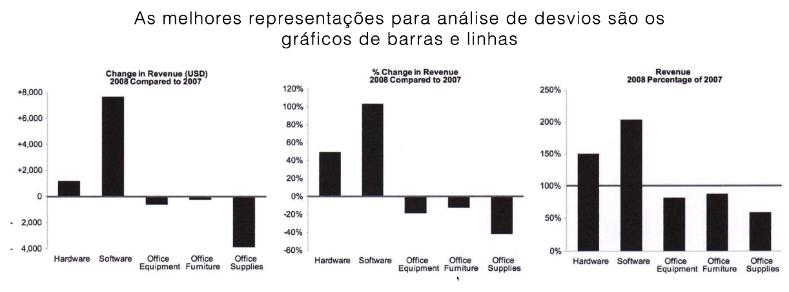

# Desvio

Analizar como um ou mais valores se desviam de um conjunto de referência.

Exemplos de análises de desvio:
1. Alvo atual ou futuro
2. Mesmo valor no passado
3. Período imediatamente anterior
4. Norma ou padrão
5. Outros itens da mesma categoria

# Representações Visuais

## Barras

## Linhas

É importante se queremos mostrar a forma do gráfico.

Compare os desvios com valores de referência, como variancia e meta.

Tambem podemos usar faixas de referência com sombreados.