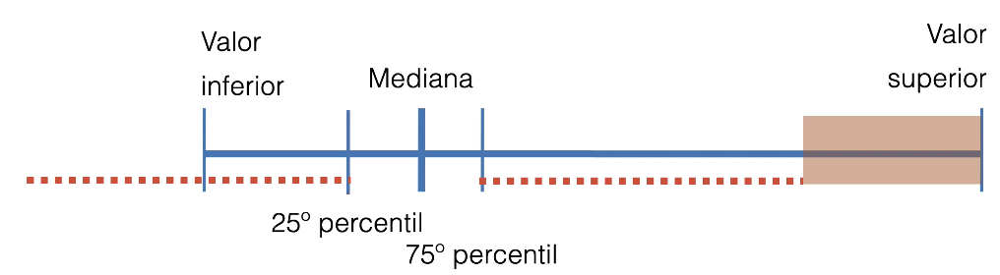

# 1. Distribuições

Nosso segundo relacionamento quantitativo

Analizar como um conjunto de valores está distribuído em um intervalo.

Mostra coisas que as métricas de média, moda e media não mostram.

Caracteristicas:
1. Espalhamento
2. Centro:
    - Mostra a concentração dos valores
3. Forma

Padrões Analíticos
1. Curva
   1. Decrescente
   2. Crecente 
      1. Um pico
         1. Simétrica
         2. Enviesada
      2. Vários picos
      3. Lacunas
      4. Concentrações
2. Plana

**Identificar exceções**

Achar o ponto médio entre o 25° e o 75° percentil, multiplicar po 1.5 e somar e subtraír dos 25° e o 75° percentil. Os valores fora desse intervalo são anomalias.




# 2. Principais Representações

## 2.1. Histograma

Tamanho da barra é a frequência.

## 2.2. Polígono de Frequência

Histograma usando pontos conectados por linhas

## 2.3. Stem And Leaf

Um tipo de histograma de números

```
1. 8 9 9 9
2. 0 0 1 1 3 3 3 4 4 4 5 6 6 6 6 6 6 7 7 8 8 9 9 9 9 9
3. 0 0 0 0 1 1 2 2 2 2 22 2 3 3 3 3 3 4 4 4 5 5 5 6 7 8 9
4. 0 0 0 0 1 1 2 2 3 3 4 4 5 5 5 6 6 6 7 8 9
5. 0 0 1 3 5 7 9
6. 1 4 8
```

No exemplo fixamos a cada das dezenas e mostramos as unidades que a acompanham

Bem usado nos quadros de horários de onibus.

Usar no máximo 2 valores no stem e 3 valores no leaf.

## 2.4. Box Plot

Caixa que representa 50% dos dados, entre o 25° percentil e o 75°percentil

A linha no meio da caixa é a media

Tambem é indicado o menor e o maior valor

Uma alternativa é colocar o maior valor no 95° percentil e o resto ser representado como pontos, que são anomalias no dado

## 2.5. Gráfico de Densidade

Parece com o polígono de frequencia 

## 2.6. RUG Plot ou Bar COde

Plot de enventos em forma de barras de cores em uma barra maior que é o intervalo de valores.

## 2.7. Violin ou Bean Plot

Gráfico de densidade, mas é simétrico 

Bom para comparar vários distribuições

## 2.8. Strip Plot

Cada evento é um ponto e estimamos a frequencia pelo número de pontos ( tipo um scatter )

## 2.9. Jitterd Strip Plot

Adiciona um pequeno ruído para facilitar a visualização de pontos que ficariam sobrepostos

## 2.10. Bee Swarm Plot

Os pontos não se sobrepoem, ficam uns encostados nos outros
Não é muito preciso, mas é bonito haha. Serve para dispertar o interesso das pessoas

## 2.11. Unit Plots

Conseguimos ver cada ponto do nosso gráfico. Quem forma a frequencia são os dados em sí.

Vantagem: Bom para interagir com o mouse pois cada ponto é um dado.

## 2.12. Mapas de calor

Normal, como todo mapa de calor mas sendo usado como distribuição

# 3. Boas práticas

- Manter intervalos coinsistentesd\
  - Ex: de 5 em 5 
- Use métricas resistentes a exceções
  - Mediana

