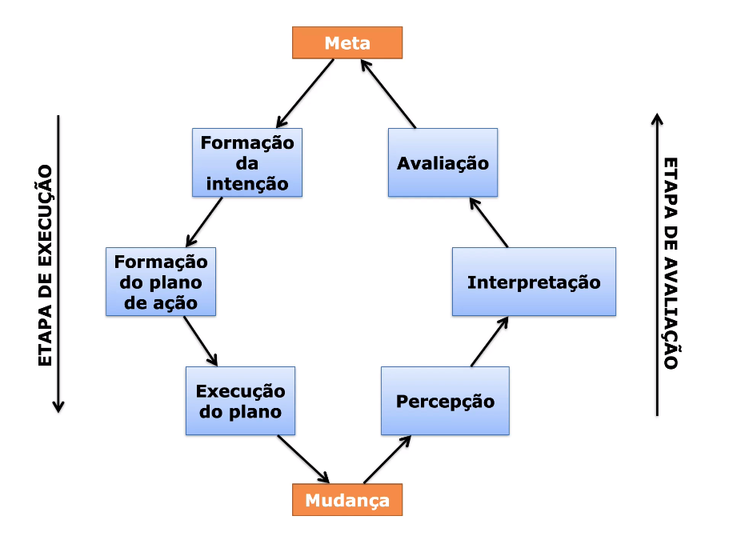

# Técnicas de interação analítica

Uma boa visualização precisa tanto de uma representação adequada quanto de meios de interação.

## Espaço Informacional

Espaço de representação para a visualzação
- Discretos: coleção de entidades discretas
- Contínuos: relações matemáticas contínuas entre valores de componentes

## Modos de interação

- Contínua: exploração contínu entre valores
- Discreta: uma ação causa modificações discritas no espaço informacional
- Passiva: Animações
  - Display estático: A atenção funciona como se fosse uma hierarquia, devemos dar uma visão geral do sistema
  - Display não estáticos: Garantir que o estado atual e a mudançã seja percebidos e consistentes. Comum o uso de transições e tranformações 
- Composta: Composição das 3 acima

## Intenções

- Aprendizagem
- Exploração
- Oportunista
- Involuntário

## Ciclo de ações de norman

Duas etapas:
- Execução: A interação com a visualização
- Avaliação: reflete e tira suas conclusões

## Interação contínua

Tarefa: encontrar uma casa para alugar

1. Intenção: Pode haver dificuldade em saber o que você quer
   - Deve mostrar ao usuário informações úteis, como histogramas com o número de casa por critério 
2. Plano de ação: Pode haver dificuldade em definir uma estratégia de interação, quais variável estão disponíveis.
   - Variar os critérios visando verificar o número de casa existentes
3. Execução: Pode haver dificuldade em encontrar as variáveis/colocar na ferramenta aquilo que eu quero fazer
   - O sistema deve facilitar a execução da tarefa

## Integração Discreta

Tem que ajudar a pessoa a escolher as opções mais promissoras.

- Sensibilidade: Onde você consegue chegar com um único movimento
- Resíduo: O resto se não se consegue fazer com um único movimento

(Sugestão de Livro: "Não me faça pensar")

# SHOW ME THE NUMBERS - Cap 4 - Stephen Few

TÉCNICAS DE INTERAÇÃO ANALÍTICA
1. Comparação
2. Ordenação
3. Adição de variáveis
4. Filtragem
5. Realce
6. Agregação
7. Formas de expressão
   1. Ex: Mudar unidade de medida
8. Formas de visualização
   1. Ex: Mudar o tipo de gráfico
9.  Zoom
10. Mudança de escala
11. Detalhes sob demanda
12. Anotação
13. Bookmarking