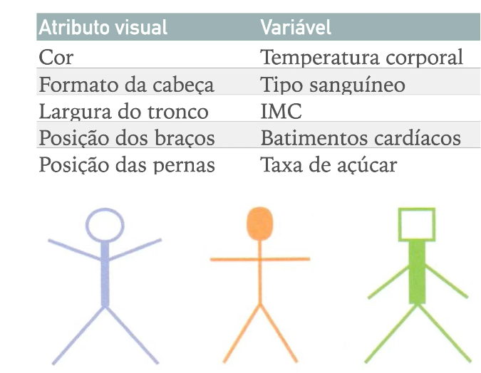

# Dados Multivaridados

Comparar muitas instâncias sobre o ponto de vista de muitas variáveis

Exp: Comparar Automóveis sobre
1. Preço
2. Consumo
3. Velocidade
4. Capacidade
5. Custo do seguro
6. ...

# Tipos de Representações

## Projeções Geométricas

Projeções 2D para dados multidimensionais 

**Matriz de gráicos de dispersão**: Comparar Pares de variáveis. Aproveitar a diagonal para mostrar outros dados.

**Coordenadas paralelas**:Cada linha é um indivíduo, cada eixo e uma variável.

**Coordenadas estrela**: Projetar vários eixos em um plano.

**Mapas de Calor**:Dimensões como linhas ou colunas. Problema: Daltonismo

## Representações hierárquicas

**Eixos Hierárquicos**: muito complexa

## Representações iconográficas

Mapear objetos em ícones ou glifos

**faces de Chernoff**: Parte do presuposto que temos facilidade de diferenciar faces

**Whiskers** :Uma "estrela" que pode variar o tamanho de cada aresta

**Glifo Estrela**: Conectar as pontas para fazer um poligono. Importante usar regiões de referenicia

**Baseadas em varetas**: Usa os ângulos para representar as variáveis

**Baseadas em cartões**

## Técnicas orientadas a pixels:

Representar cores em um bloco de atributos.