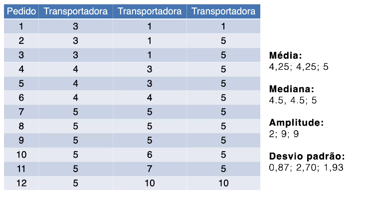
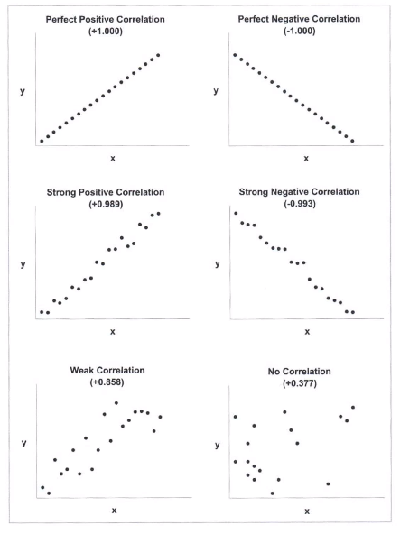

# Tabelas e gráficos - aula 7

 O gráfico deve sempre conter informação do contexto dos dados, como:
 1. Título
 2. Unidades
 3. Data

Deixar claro o que deve ser comparado no gráfico.

## Pizza vs Barras

No gráfico de pizza nos temos dificuldade de estimar a área de cada fatia e ordena-las. O gráfico de barras pode ajudar muito nesses dois quesitos.

## Propósito de tabelas e gráficos

Comunicação de dados de forma efetiva usando as visualizações adequadas.

## Informação Quantitativa

Dois tipos de dados:
1. Quantitativos: medições
2. Categóricos: subdividem grupos úteis

Esses dados têm diferentes papéirs em gráficos e tabelas

Informações quantitativas são sempre relacionamentos:
1. Simples: Quantitativo - Categórico
   1. Unidade / região
   2. Lucro / intervalo de tempo
2. Complexos: Quantitativo - Quantitativo
   1. Gasto / número de pedidos
   2. Preço / unidades vendidas

Relacionamentos de categorias:
1. Nominais: Categorias sem ordem intrínseca (norte, sul, leste, oeste)
2. Ordinais: Categorias com ordenação precisa (primeiro, segundo, pequeno, médio)
3. Intervalos: intervalos sequenciais que dividem um conjunto quantitativo ( faixas e renda)
4. Hierárquicos:  múltiplas categorias que estão relacionadas em diferentes níveis de organização (instituto, departamento, cursos)

Relacionamentos de quantidades:
1. Ranking: sub-divisões com ordenação
2. Razão: dois valores comparados pela divisão
3. Correlação: Comparando crescimento de dois conjuntos de valores

Medidadas importantes:
1. Média: Dar contexto aos dados
2. Percentil: A mediana é o 50° percentil

**Exemplo de Medias**

Rank | Cargo | Salário
-----|-------|---------:
1    | Vice       | R$ 475.000
2    | Gerente    | R$ 165.000
3    | Gerente    | R$ 165.000
4    | Analista   | R$ 65.000
5    | Artista    | R$ 64.000
6    | Analista   | R$ 63.000
7    | Artista    | R$ 62.000
8    | Escritor   | R$ 54.000
9    | Escritor   | R$ 52.000
10   | Assistente | R$ 43.000
11   | Assistente | R$ 39.000
12   | Estagiário | R$ 28.000
13   | Estagiário | R$ 25.000

Medidas:
1. Média: R$ 100.000
1. Mediana: R$ 62.000
1. Moda: R$165.000
1. Valor Intermediário: R$250.000
1. 25° Percentil: R$39.000
1. 75° Percentil: R$64.000

**Exemplo de Distribuição**

A amplitude e desvio padrão também são importantes.

**Exemplo de Correlação**

_______________________________________________

# Tabelas - aula 8

## Organização

Organizar a tabela para contar uma história.

Geralmente preferimos um **arranjo bidimencional** se as subdivisões forem pequenas.

**Series temporais** geralmente são organizadas na horizontal e rankings na vertical.

Aproveitar da **lei da similaridade** para separar corretamente os dados em colunas ou linhas com espaços em branco.

**Grids e linhas** usados para agrupar ou ressaltar subconjuntos de dados

**Sequenciamento**: Nunca colocar um valor derivado na esquerda. A pessoa vai ser a tabela da esquerda para a direita. Cololcar colunas de comparação lado a lado. Respeitar ordenações naturais.

**Orientação do texto**: bem raro em tabelas

**Alinhamento**: Números sempre a direita e com o mesmo número de casas decimais. Data e só deixar todos bem alinhados (dd/mm/aa ou dd/mm/aaaa). Alinhar títulos aos dados

**Precisão** dos números devem ser apenas a necessária.

**Sumarização de valores** é sempre importante, como total e média.

_______________________________________________

# Gráficos - aula 9

**Escalas**, **Cores** e **proporção entre eixos** do gráfico podem mudar completamente a informação passada com o gráfico. a **Escala** dos eixos principalmente pode ampliar uma variação que na verdade é muito pequena para o contexto do gráfico.

Devemos aproveitar dos **pequenos multiplos** para mostrar mais dimensões dos dados.

## Elementos dos gráficos

**Pontos** devem ser bem distintos. Devemos usar formatos bem distintos e sempre que possível usar cores. É preferível usar mais de um atributo visual. Linhas entre pontos devem ser bem mais finas que os pontos em sí.

**Barras**:
1. Orientação: 
   1. Horizontal: Ranking, ou se as labels não couberem, para evitar de achatar as barras.
2. Separação: 
   1. Propoção 1:1.5 e 1:0.5 entre largura da barra e espaço entre elas
   2. Um exceção em barras agrupadas para representar subgrupos
   3. Sobreposição pode ser usada para avaliar correlação ( usar larguras diferentes)
3. Preenchimento:
   1. Evitar padrões
   2. Usar paletas de cores seguras 
   3. Balancear as cores
4. Bordas:
   1. Evitar a todo custo
   2. Geralmente não adiciona inforção
   3. Pode ser usada para dar ênfase a uma barra específica
5. Bases:
   1. Deve sempre começãr de zero. 
   2. Podemos abrir uma exceção para barras que representam trechos
   
**Linhas**:
1. Cores:
   1. Evitar padronagens 

**Obs**:
1. Podemos usar escalas diferentes, como log, para visualizar melhor os dados.
2. Marcações de eixos devem estar fora da área de dados. Usar valores padrões e claros.
3. Legendas de preferencia fora da área de dados e próximas.
4. Evitar muitas categorias em gráficos para facilitar a memorização.
5. Grid é útil para facilitar a comparação entre dados e devem ser sempre secundários.