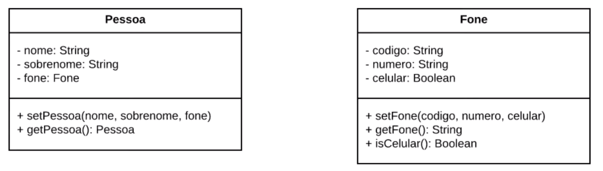
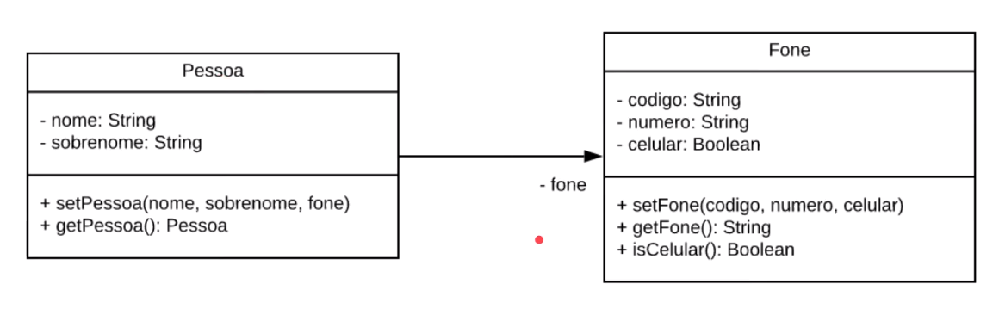
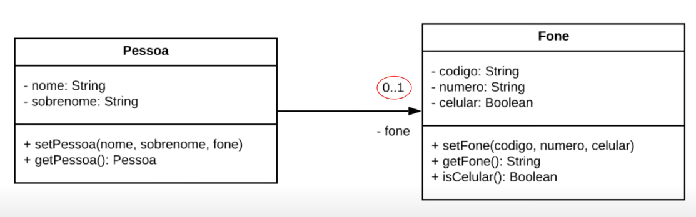
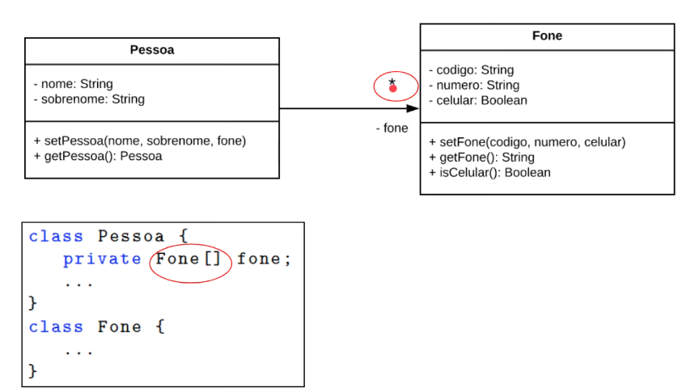
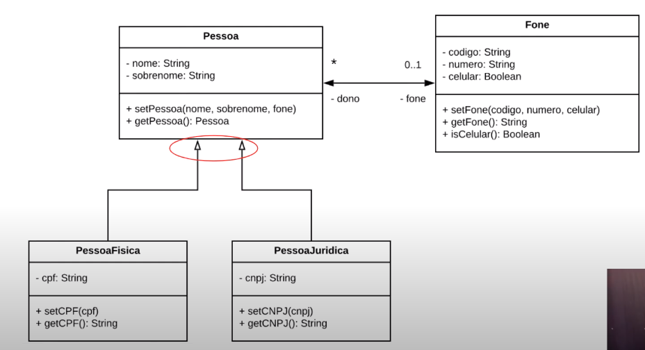
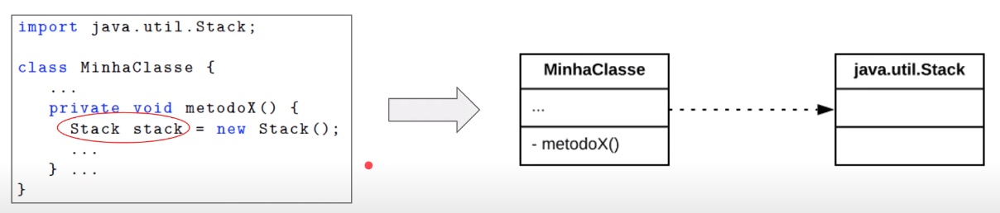
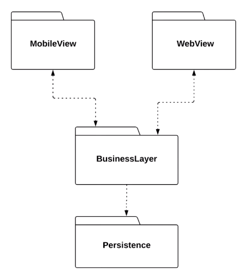
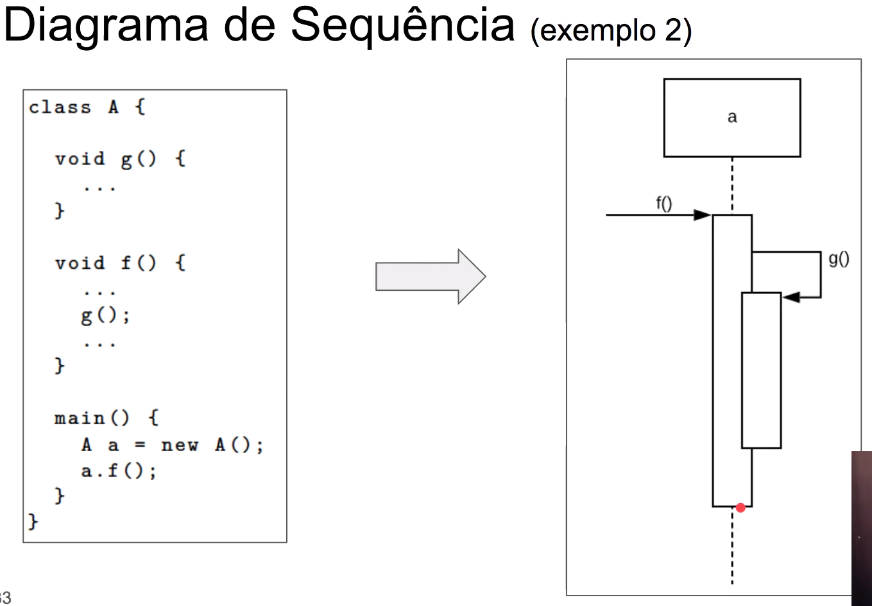
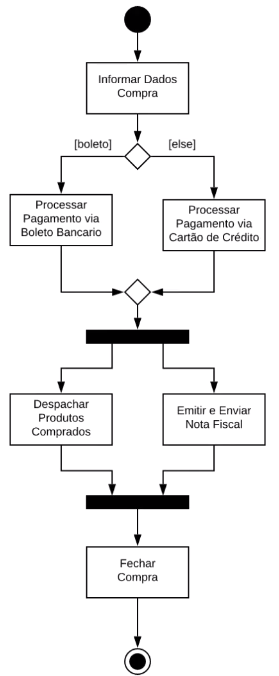

# Modelos

## Motivação

Preencher a lacuna entre os [Requisitos](Cap3-Requisitos.md) e o Código via uma notação com um nível de abstração intermediário.

Ajudar a conveber soluções para problemas apresentados pelos requisitos

Eles não são tão efetivos como em outras engenharias

Modelos de software podem ser:
1. Formais: menos comuns
2. Gráficos: UML é o mais comum

## UML: Unifiead Modeling Language

Proposta em 1995, para fundir outras notações

Contexto de processos antigos em que o código só era escrito após meses ou anos de trabalho, com a documentação e planejamento muito bem detalhados

Contava com ferramentas **CASE**, para desenhar modelos UML.

**Como usar o UML?**

1. Blueprint: Projetio detalhado da aplicação
2. Linguagem de programação: Geração automática de código (pouquíssimo usado)
3. **Sketches: Esboço do sistema**

**UML como Sketch**

Mais comum entre os métodos ágeis.
É usada para representar conversas e decisões sobre partes do código
Uso mais informal, e **não** tem como objetico ter um modelo completo

Engenharia Avante vs Engenharia Reversa:
1. Avante: Usada para discutir algo que ainda vai ser produzido
2. Reversa: Usada para discutir código que já existe, para documentação ou explicar para alguem do time

## Diagramas UML

Os diagramas se dividem em dois grupos, **estáticos e dinâmicos**.

Os **estáticos** modelam a estrutura do código, e os **dinâmicos** a execução do código

Vamos estudar 4 diagramas:
1. Dinâmicos:
   1. Atividade
   2. Sequencia
2. Estáticos:
   1. Classes
   2. Pacotes

## Diagrama de Classes

Principal diagrama UML

Representa as classses de um sistema

| Nome da Classe |
|:--------------:|
|Atributos|
|Métodos|

**Associações**

Tiramos o Fone e fizemos a seta

**Multiplicidade**

O atributo **fone** pode referenciar 0 ou 1 objetos da classe fone

O atributo **fone** pode referenciar 0 ou mais objetos da classe fone

**Herança**

**Dependencia**

## Diagrama de Pacotes

Pacotes são conjuntos de classes. Da uma visão de mais alto nível do sistema

BusunessLayer usa classes de Persistence, mas Persistence não usa classes de BusunessLayer

## Diagramas de Sequência

São diagramas dinâmicos que modelos a execução de um sistema. 

## Diagramas de Atividades

Tambêm é dinâmico e modela em mais alto nível o diagrama de sequência.

 

1. Circulo colorido: Início
2. Retangulo: Ação
3. Logangulo: Decisão
4. Retangulo colorido: paraleliza o fluxo ou sincroniza o fluxo
5. Circulo colorido com borda: Fim
