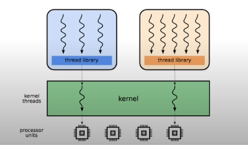
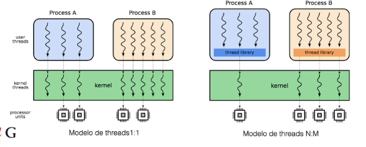

# Processos e Threads

## Processos x Thread

### Thread
Sequência de operações definida por um fluxo de instruções (trecho de código)
### Processo
Espaço de memória protegida em um computador com pelo menos uma **thread** assiciada

Thread   | Processo
--------- | ------
Memória isolada entre fluxos | Diversos fluxos em um processo
SO provê áread de mem. compartilhada | Toda memória é compartilhada
Maior custo de criação | Menor custo de criação
Maior proteção entre fluxos | Falhas podem afetar outras thread

## Threads de usuário

No passado, um processo só possuía uma sequencia de execução. O Usuário conseguia abstrair threads usando uma **biblioteca de threads**, mas eram invisíveis para o núcleo. Essas threads na verdade funcionavam apenas com troca de contexto e uma thread era capaz de bloquear todo o processo, já que o núcleo só exergava um fluxo de dados.

Modelo de thread (N:1)

## Threads de núcleo
Agora o núcleo consegue enxergar as threads criadas dentro do processo. Se uma thread é bloqueada, as outras continuam a ser executadas. A troca de contexto é mais custosa, pois ocorre dentro do Sistema Operacional. Modelo de thread N:1

Isso não impede o uso de **thread de usuário**, então temos o modelo N:M

## Lib de Threads

**pthreads em C**

[pthreads - Tutorial POSIX Threads Programming](https://computing.llnl.gov/tutorials/pthreads/)

**thread em python**

Mais geral: [Threading](https://docs.python.org/3/library/threading.html)

Tem um problema que, apesar de existir várias threads, todas elas devem passar pelo menos interpretador. Para explorar multiplos **cores**, devemos usar o pacote [multiprocessing](https://docs.python.org/3/library/multiprocessing.html)

Thread é util em python apenas para tarefas com Entrada/Saída, para não bloquear o fluxo em escrita e leitura.