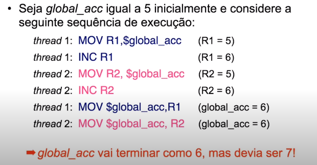

# Condição de Corrida (race condition)
 
## Introdução

A **condição de corrida** surge do desafio de conseguir fazer threads e processos se comunicarem usado a memória compartilhada

Temos o problema de mais um fluxo tentar escrever na memória compartilhada ao mesmo tempo. A leitura e escrita simultânea dos registradores faz com que valores errados sejam lidos, e conseguentemente, escritos.

**Exemplo**

Esse trecho que ocorre condição de corrida é chamado de **seção crítica**



Para resolver isso, precisamos de **sincroninação**

```python
def worker(number):
    global global_acc  # Memória compartilhada
    global num_iters
    for i in range(num_inters):
    global_acc += 1     # Seção crítica
```

No python, o **Lock** é uma ferramenta de sincronização