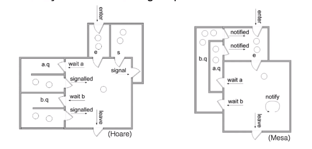

# Variáveis de Condição - [Aula no youtube](https://www.youtube.com/watch?v=F65DwhKrtB8&feature=youtu.be)

## Semáforos

Proposto por Dijkstra. A ideia principal é conter dois contadores que só podem ser modificados com operações atomicas.

Consiste em duas operações:
1. `P()` / `Down()` / `wait()` / `acquire()`: Se o contador é 0, espera até ser maior que 0. Se e maior que zero, decrementa o contador
2. `V()` / `Up()` / `post()` / `release()`: Incrementa o contador. Se havia tarefas esperando, só uma é liberada.

<table>
<tr>
<th>Semáforos</th>
<th>Produtor</th>
<th>Consumidor</th>
</tr>
<tr>
<td>

```python
import threading
a_lock = threading.Semaphore(1)
empty_slot = threading.Semaphore(N)
full_slot = threading.Semaphore(0)
```

</td>
<td>

```python
empty_slot.acquire()
a_lock.acquire()
buffer[in] = nextProduced
in = (in + 1) % N
count += 1
a_lock.release()
full_slot.release()
```

</td>
<td>

```python
full_slot.acquire()
a_lock.acquire()
nextConsumed = buffer[out]
out = (out + 1) % N
count -= 1
a_lock.release()
empty_slot.release()
```

</td>

</tr>

</table>


## Monitores

Passar os detalhes para a linguagem. O programador não precisa se preocupar. Todos os métodos são protegidos e podemos atribuir variáveis de condição específicas.



## Outras abstrações

Barreiras: fazer todos os processos esperarem antes de prosseguir o código

Guarded clauses: defir uma condição para executar o código em exclusão mútua.

Memória transacional: posição de memória que funciona com oferações atomicas. Exclusão mútua por hardware.