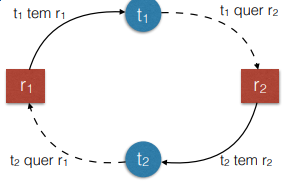
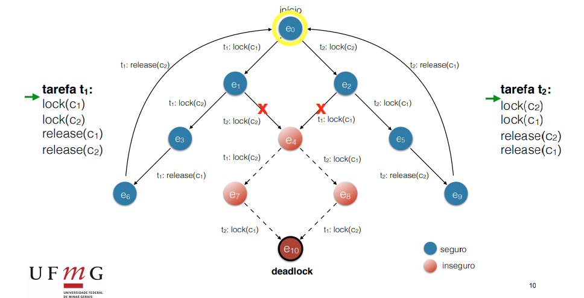

# Deadlock

Temos várias tarefas, mas nenhuma delas evoluem pq elas dependem umas das outras.

É bem representado no jantar os filósofos quando todos pegam o garfo da direita ao mesmo tempo.

# Condições para um impasse

1. Exclusão mútua
3. Posse-e-Espera:
   1. Posso ter alguns recursos alocados e esperar que mais recursos estejam disponíveis
4. Ausência de preempção
   1. Depois que eu consegui exclusão mútua, não tem nenhuma fora de perde-lo por forças externas
5. Espera circular
   1. Cada tarefa possui algo que a outra tem.
   - 

# Tratamento

Como lidar ?
1. Prevenir
2. Impedir
3. Detectar e corrigir

## Prevenir

Evitar que as quatro condições aconteçam simultaneamente.

1. Exclusão mútua:
   1. restringir controle de um recurso a uma tarefa apenas
2. Posse-e-espera
   1. forçar as tarefas a pedir todos os recursos de uma vez só
3. Ausência de preempção
   1. Perminitir preempção
4. Espera circular
   1. Garantir que a ordem de travamentos não crie ciclos

Em geral, nas memórias compartilhadas, só 2 e 4 funcionam.

### Exemplos:

#### Não permitir Posse-e-espera (Solução do saleiro)

```C
int N = 6; // N Filosofos e Hashis
semaphore saleiro, hashi[N]; // todos iniciam com 1


task filosofo(int i){ // filosofo i (entre 0 e N-1)
    while(1){
        meditar();
        down(saleiro); // <----- Só um de cada vez pode pegar talheres
        down(hashi[i]);
        down(hashi[(i+1) % N]);  // Estrutura circular
        up(saleiro); // <----- Só deixa travar os dois hashis se o saleiro estiver liberado
        comer();
        up(hashi[i]);
        up(hashi[(i+1) % N]);  // Estrutura circular
    }
}
```

#### Espera Circular: Inverter a ordem das travas

```C
int N = 6; // N Filosofos e Hashis
semaphore hashi[N]; // todos iniciam com 1


task filosofo(int i){ // filosofo i (entre 0 e N-1)
    while(1){
        // Troca a ordem dos hashis do ultimo filósofo
        first = min(i, (i+1) % 5)
        second = max(i, (i+1) % 5)

        meditar();
        down(hashi[first]);
        down(hashi[second]);  // Estrutura circular
        comer();
        up(hashi[first]);
        up(hashi[second]);  // Estrutura circular
    }
}
```

## Impedir um impasse

A evolução do sistema deve ser acompanhada. Rotular estados como seguros e inseguras. Inseguras são estados que não se pode garantir que não vai ter deadlock, então são bloqueadas antes de acontecer.

Podemos usar o algoritmo do banqueiro



## Detecção

Periodicamente fazer uma vigia que verifica se o estado do sistema infica um impasse (deadlock). Se detectado temos que:
1. Liberar recursos à força
2. Matar processos envolvidos

Pode ser útil se as outras opção forem muito complicadas para o problema.

_____________________________________________________________________
# Lista 3
## 1

Explique cada uma das quatro condições necessárias para a ocorrência de impasses. Para cada uma das condições, indique como ela poderia ser evitada.

1. Exclusão mútua
Característica que permite que apenas uma tarefa possa acessar uma variável de cada vez.
Para prevenir podemos restringir controle de um recurso a uma tarefa apenas

2. Posse-e-Espera
Posso ter alguns recursos alocados e esperar que mais recursos estejam disponíveis durante a execução
Para evitar isso podemos forçar as tarefas a pedir todos os recursos de uma vez só antes de iniciar (solução do saleiro)

3. Ausência de preempção
Depois de conseguir a exclusão mútua, não tem nenhuma forma de perde-lo por forças externas
Para prevenir podemos permitir preempção

4. Espera circular
Cada tarefa possui algo que a outra tem.
Para prevenir devemos garantir que a ordem de travamentos não crie ciclos ou monitorar os estados dos programa ( inverter ordem das travas ou usar algoritmo do banqueiro)

## 2
Diferencie prevenção (prevention), impedimento (avoidance) e detecção de impasses.


Prevenção:  Evitar que as quatro condições existam simultaneamente .

Impedimento:  Impedir que o programa entre no estado que pode levar a um deadlock, mas permite que as condições existam

Detecção: Periodicamente fazer uma vigia que verifica se o estado do sistema infica um impasse (deadlock). Se detectado temos que:
1. Liberar recursos à força
2. Matar processos envolvidos


## 3

Imagine que há três fumantes inveterados ao redor de uma mesa que gostam de fumar um cigarrinho de palha. Para qualquer um deles  fumar, é preciso ter palha (P), tabaco (T) e um fósforo (F). Cada um dos três possui um reservatório com apenas um desses insumos, diferente dos outros dois, e ninguém cede os seus recursos para os outros. Na mesa há três semáforos, que indicam a quantidade de cada recurso na mesa. Cada fumante precisa fazer um DOWN nos semáforos dos dois recursos que lhe faltam para fazer um cigarrinho e fumar Quando terminar seu cigarro, ele/ela voltam a esperar na mesa. Além dos fumantes, há um agente facilitador que coloca aleatoriamente dois dos três insumos na mesa e espera até que alguém termine de fumar. Quando isso acontece, ele volta a colocar dois insumos aleatórios na mesa. Escreva o pseudo-código descrevendo sua solução para esse problema. Avalie se sua solução pode sofrer deadlocks: em caso afirmativo, explique como isso pode acontecer; em caso negativo, explique porque deadlocks não acontecem.


```C++
semaphore insumos_mesa[3];

task fumante(int i){ // fumante i (0, 1 ou 2)
    while(1){
        // Tenho o insumo "i", preciso do i + 1 e i + 2
        down(insumos_mesa[(i+1) % 3]);  // Estrutura circular 
        down(insumos_mesa[(i+2) % 3]);  // Estrutura circular
        fumar();
        up(insumos_mesa[(i+1) % 3]);  // Estrutura circular 
        up(insumos_mesa[(i+2) % 3]);  // Estrutura circular
    }
}
```

Deadlocks acontecem. Supondo que a ordem dos "semaphore insumos_mesa" é [F, P, T] e o fumante 0 possui um reservatório de Fosforo(F), o fumante 1 possui Palha(P) e o fumante 2 possui Tabaco(T).  Se, ao mesmo tempo acontecer 

fumante 0 -> down( insumos_mesa[1] -> P )
fumante 1 -> down( insumos_mesa[2] -> T )
fumante 2 -> down( insumos_mesa[0] -> F )

Temos um deadlock onde todos precisam esperar a liberação de um insumo para fumar

## 4
Uma outra solução para o problema dos filósofos é determinar que no máximo N-1 filósofos se sentem à mesa ao mesmo tempo. Mostre como seria o pseudo-código, usando mutexes e variáveis de condição, para implementar essa restrição. Em termos das técnicas de prevenção e impedimento de impasses vistas, como você classificaria essa solução? Justifique sua resposta.


## 5
Implemente uma solução em C ou Python, usando semáforos ou variáveis de condição+mutex, para o problema dos leitores/escritores com priorização para escritores. Isto é: leitores podem acessar a base de dados simultaneamente, mas só se não houver nenhum escritor esperando no momento em que eles pedem para ler. Mesmo que já existam leitores acessando a base de dados, um novo leitor não pode entrar se algum escritor estiver esperando. (Basicamente, essa é a atividade 3 do capítulo 12 do livro do Mazieiro, com mais opcões de implementação.) 


```C++
int readCount = 0;

semaphore area(1); // controll read/write area
semaphore rmutex(1); // controll readcount
semaphore ordering(1); // preserves ordering

void reader(){
    ordering.down();
    rmutex.down();

    readCount++;
    if(readCount == 1)
        area.down(); // firt reader request read/write area
    
    ordering.up(); // next in line
    rmutex.up() // release readCount

    some_computation();

    rmutex.down() //get readcounty
    readCount--;
    if(readCount == 0)
        area.up() // last to get out
    rmutex.up() // release counter
}

void writer(){
    ordering.down();           // wait in line to be serviced
    area.down();               // request read/write area
    ordering.up();           // let next in line be serviced
    
    write_something();
    
    area.up();
}
```