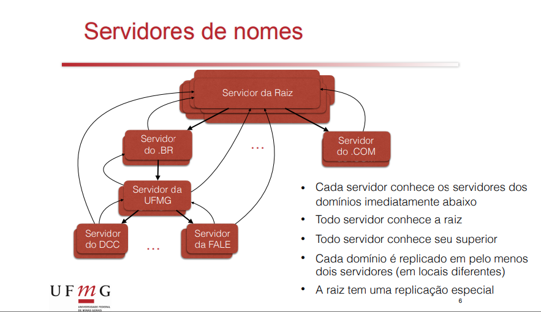
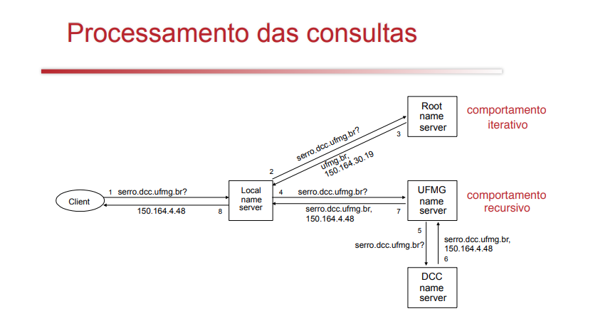

# DNS

Ótimo exemplo de sistema distribuído:
1. Altamente escalável
2. Distribuídos geograficamente
3. Administração descentralizada
4. Altamente interoperável e aberto
5. Transparência de localização
6. Resistente a falhas e ataques

**Contexto**: Precisamos ter o nome e ip de todos os computadores da Internet.

Ele possui uma estrutura hierárquica. O espaço de nomes é dividido por domínios.

1. Raiz
   1. int
   2. com
      1. ibm
         1. eng
   3. edu
      1. berkeley
   4. gov
   5. mil
   6. org
      1. acm
         1. dl
         2. www 
      2. ieee
   7. net
   8. us
   9.  br
      1.  com
      2.  ufmg
          1.  dcc
   10. yahoo
   11. ups

A raiz começou como 13 máquinos no mundo, mas agora elas são duplicadas em diversas localições no mundo.

**Processamento de consultas**

- Recursivo
  - Reduz a carga no servidor local
  - POde manter cache

**Mais informações**

ferramentas `nslookup`, `dig`