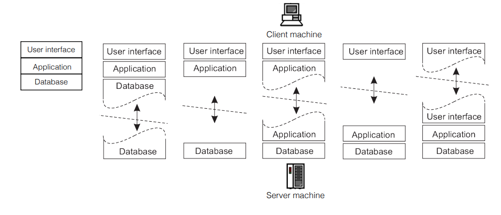

# Arquitetura cliente-servidor

Temos dois tipos máquinas:
1. Cliente
   1. Faz requisições ao servidor
2. Servidor
   1. Espera por requisições dos clientes

# Cliente Servidor em camadas

Na web, por exemplo, temos que organizar as aplicações em:
1. User Interface: a interface com o usuário
2. Application: o nível de processamento da aplicação em si
3. Database: o sistema de acesso à base de dados associada

Podemos dividir essas camadas entre cliente e servidor de diferentes maneiras. O último exemplo é o mais comum e temos um servidor por camada

Talvez precisamos ter mais servidores em cada camada, então ele repcisa ter tranparência e escalabilidade.

Agora é tarefa do programador controlar acesso simultâneo a dados, semelhante aos problemas de processos paralelos estudados antes.

# Cliente Servidor com múltiplos serviços

Com o grande volume e complexidade dos sistemas, adaptamos para esse sitema de múltiplos serviços que se aproxima de um grafo.

