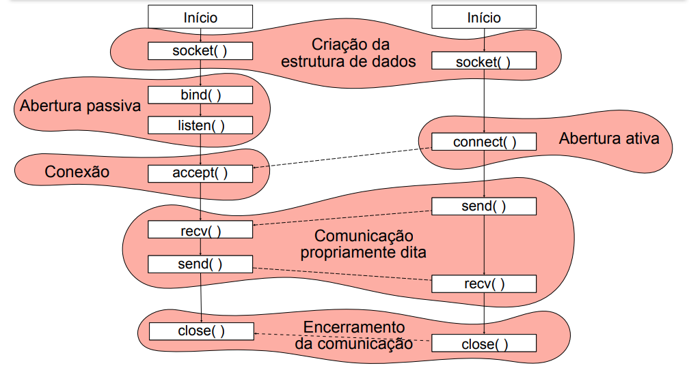

# Sockets

Uso de interfaces simples para programação de sistemas distribuídos orientados a mensagens.

Na internet temos dois tipos de sockets: com ou sem conexão (TCP x UDP)

# Comunicação com conexão

Mais simples pro programador pois antes de enviar mensagens já existe um canal de comunicação com origem e destino.

O servidor faz uma abertura passiva. Ele está pronto para receber uma conexão mas ainda n sabe com quem.

O cliente faz abertura ativa. Se conecta com um servidor específico.

Na internet é implentado como o protocolo TCP
- Canal de bytes bidirecional
- Entrega garantida e em ordem (se a rede estiver funcionando)

## Definindo um endereço na rede

Na internet, todo processo que se comuninca precisa de um endereço(IP:porto)

Quem começa uma comunicação pode reservar um endereço qualquer e incluir na mensagem. Quem espera receber mensagens precisa estabelecer um endereço bem conhecido na rede (bind).

## Comunicação entre processos (com conexão)

## Observações

Estamos manipulando bytes, então temos que nos certificar que estamos enviando a codificação correta (ou use um serializador)

Em python, a representação e controlada pelo interpretador.

Send e Recv podem precisar ser feitas mais de uma vez se o pacote for fragmentado.