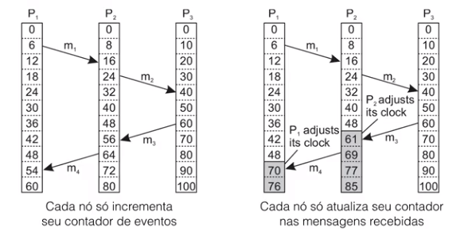

# Relógio Lógico

Não precisamos saber exatamente quando algo aconteceu, precisamos apenas saber a orden que as coisas aconteceram.

Usa-se um contador de eventos. Eventos de um nó são ordenados pelo seu valor do contador.

Sincronização entre máquinas sempre exige comunicação.

1. Quando ocorre um evento, incrementamos o contador em 1
2. Quando um processo envia uma mensagen, incrimentamos o contador em 1 e o incluímos na mensagem
3. Quando uma mensagem é recebida, o contador é atualizado com o maximo entre o contador local e o contador da mensagem, e então o incrementamos em 1.

Só conseguimos saber a ordem dos enventos ligados por mensagens ou se ocorreram dentro de um mesmo processo.

## Com multicast

Em todas as mensagens, o contador é comunicado com todos os relógios. As relações entre relógios ficam mais fortes ao longo do tempo.

# Aplicação

## Total Order Multicasting

Imagine que temos um aplicação distribuída, com uma base de dados que se replica em dois lugares. Perto de cada lugar existe um cliente que vai alterar a base, mas a mensagem do cliente 1 chega primeiro na base 1, e a mensagem do cliente 2 chega primeiro na base 2. Como garantir que as operações nas bases foram feitas na mesma ordem?

1. Todos os eventos de interesse geram mensagens
2. toda mensagem é envidada para todos, inclusive para o próprio nó
3. toda mensagem recebida é logo confirmada por multicast
4. Ao receber uma mensagem, o nó a insere em uma fila na camada de comunicação
5. a fila e mantida ordenada pelo contador da mensagem
7. Só se processa um evento se ele está na frente da fila e a confirmação de todos os outros nós também estão na fila
8. Quando processamos uma mensagem, retiramos as confirmações da fila também.

**Detalhe**: Não precisamos enviar ACK, pode ser outra mensagem nova

**Problemas**:
1. Mensagens levam tempo para se propagar
2. Só temos relação entre eventos ligados pelo envio de mensagens
3. Manter a ordem exige Nx(N-1) mensagens/evento (N = Processos)