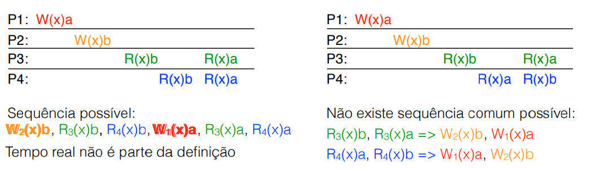
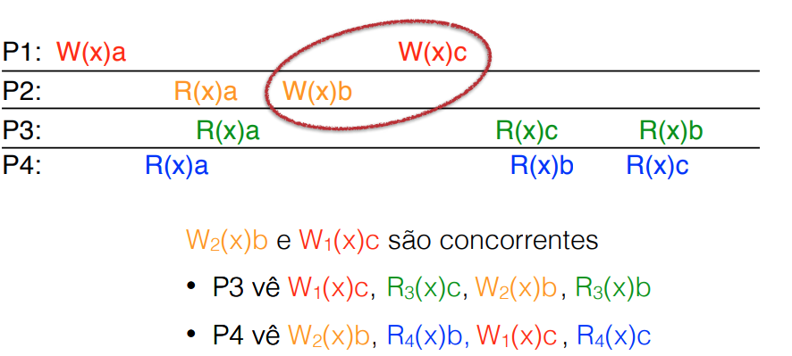
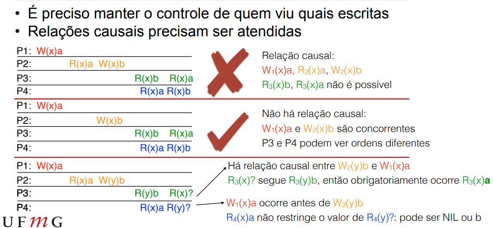

# Modelos Centrados nos Dados

Contratos que definem como o sistema se comporta quando os dados mudam.

**Motivação**: Queremos usar replicação de dados para permitir melhor desempenho, mas a manutenção da consistência tem um preço.

Muitas vezes precisamos reduzir garantias de consistência para se obter o desempenho desejado.

# Consistência centrada nos dados

Temos dados armazendos em réplicas e cada processo pode acessar uma réplica local/próxima.

Alterações são propagadas para demais réplicas

Não tenho nenhuma garantia sobre o relógio global dos processos.

Principais modelos:
1. Consistência Contínua
1. Consistência Sequencial
1. Consistência Causal
1. Consistência de Entrada
1. Consistência Eventual

Notação:
1. Wi(x)a = Processo **i**  relaizou uma **escrita W()** do valor **a** no elemento **x**
2. Ri(y)NIL = Processo **i**  relaizou uma **leitura R()** no elemento **y** e obteve o valor **NIL** (valor original antes da inicialização)

## Consistencia Contínua

Primeiro vamos definir todas as alterações que meu sistema pode ter. Para cada alteração eu vou determinar delimite de diferença que eu posso esperar de uma cópia para outra.

As alterações são avaliadas em 3 eixos:
1. Desvios nos valores numéricos:
   1. Os valores não ficar mais longes uns dos outros X% ou Y unidades.
   2. Meu sistema tem que garantir que em toda alteração, todo mundo vai ter um valor final que estará dentro do limite estipulado.
2. Variações no grau de obsolência (staleness)
   1. Agora válido para qualquer tipo de dado.
   2. Garante que eu não posso ter um dado que seja X mais velho que a cópia atual. \
3. A ordem dos eventos não podem ser diferentes por X operações

A Aplicação define o nível de desvio aceitável e o sistema monitora e mantém os desvios sobre controle.

## Consistência Sequencial

O efeito de cada execução é o mesmo que seria obtido se todas as escritas/leituras fossem executadas em uma ordem sequencial e sem inversões dentro de cada programa.

Todos os processos percebem a mesma ordem dos eventos.

Mais simples que a consistência estrita, temporal. Não tem restrição relativa ao tempo global então é mais fácil de implementar.

Exige que todos concordem com a ordem. Eventos precisam ser "vistos" e ordenados por todos os processos antes de serem executados.

## Consistência Causal

Eventos que tem relação causal são vistos por todos na mesma ordem.

Eventos concorrentes podem ocorrer em ordem diferentes para máquinas diferentes e ainda deixa o sistema válido.

## Consistência de Entrada

Assume uma mutex/trava para cada elemento acessado: L(x)/U(x)

Todas as alterações feitas entre um L() e um U() se tornam visíveis para todos os participantes após as liberação U.

Acesso sem trava não tem nenhuma garantia

Simplifica o sistema de consitência pois ele só tem que manejar o mutex.

## Consistência Eventual

Em muitos casos não precisamos de um consistência tao pesada... A demanda pode ser bem baixa.:
1. A maioria dos processos raramente fazem atualização
2. Na web, alterações são limitadas a uma entidade
3. No DNS, apenas o domain manager atualiza entradas

Se não houver conflitos(alterações concorrentes), eventualmente todas as replicas terão o mesmo valor.

Conflitos envolvem poucos processos de cada vez, nesse caso a resolução pode ser feita sob controle externo, como deixar pro usuário decidir o dado correto, como no Dropbox.