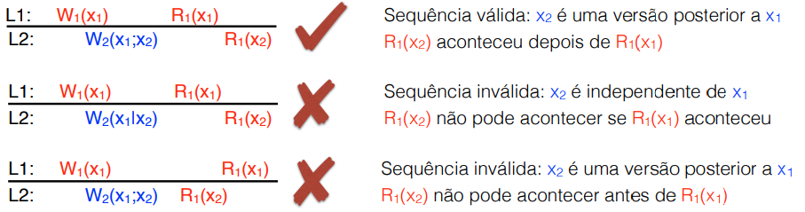
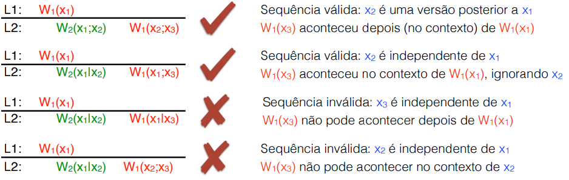
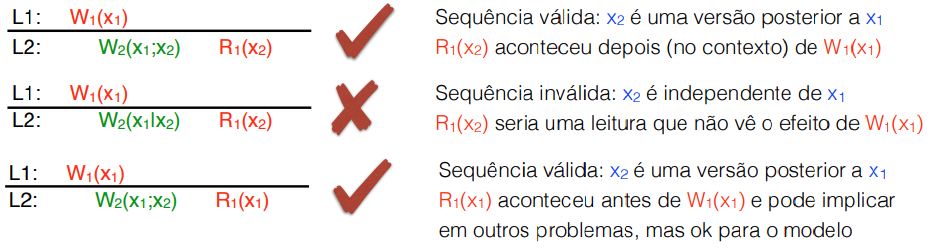
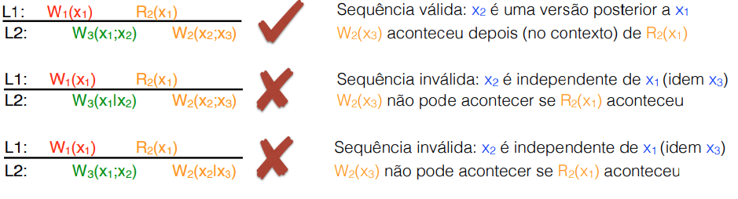

# Consistência Eventual - Modelos centrados nos clientes

Na ausência de conflitos, dado tempo suficiente, todas as réplicas convergem para o mesmo estado

Se um cliente sempre lê da mesma réplica, pode ser que ele nem perceba que esta inconsistente com outras réplicas. Mas quando há a possibilidade de usar várias réplicas pode ser que o usuário perceba anomalias, então é preciso definir o que deve ser esperado.

Notação:
- Wi(Xj): O processo i realizou uma escrita (W) do j-ésimo valor do elemento X.
- Rj(Yk): O processo j realizou uma leitura (R) no elemento Y e obbteve a k-ésima versão.

Nem sempre uma escrita remove todo o contúdo anterior. Elas podem ser alterações particiais.
- Remover a ultima linha de um log
- etc...

Notação:
- Wi(Xj;Xk): O processo i escreveu (W) a k-ésima versão do elemento x sobre ( ; ) sua i-ésima versão
- Wi(Xj;Xk): O processo i escreveu (W) a k-ésima versão do elemento x independente de ( | ) sua i-ésima versão

# Modelos de Consistêncua

## Leituras monotônicas

Se um processo lê um valor de um item X, qualquer leitura subsequente de x por aquele processo tem que retornar aquele valor ou outro mais recente.

## Escritas monotônicas

Uma escrita de um dado processo em um item X é completada **antes** de escritas **subsequentes** em x pelo mesmo processo

## Leia suas escritas (read your writes)

O efeito de uma escrita por um processo em X sempre será vista pelas leituras posteriores de x pelo mesmo processo. Independente de onde o processo faz a próxima leitura.

## Escritas seguem leiturass (writes follow reads)

Uma escrita em X por um processo ocorre sempre em uma versão de x igual ou mais recente qeu a sua última leitura. Independente de onde o processo faz a próxima leitura.

# Como implementar os modelos

- Toda escrita de um cliente recebe um identificador único gerado pelo servidor onde a escrita foi feita
- Toda leitura de x feita por um cliente retorna a lista das escritas
sobre x que o servidor contactado já tinha visto até então
- Cada cliente mantém dois conjuntos de identificadores:
  - Write set: conjunto das escritas realizadas pelo cliente
  - Read set: escritas que já existiam onde cada leitura foi realizada
- Os 4 modelos podem ser implementados com esses conjuntos

- Para cada modelo, escrita ou leitura ou escrita leva consigo um conjunto:
  - Leitura monotônica: na leitura, envia o read_set
  - Escrita monotônica: na escrita, envia o write_set
  - Leia suas escritas: na leitura, envia o write_set
  - Escritas seguem leituras: na escrita, envia o read_set 

- Servidor recebe o conjunto e antes de executar a operação, precisa atualizar o dado com todas as escritas do conjunto.
- Opcionalmente, o cliente pode escolher o servidor que já deve ter o read_set/write_set mais completo. Dessa forma eu permito que o cliente mude de server durante a execução.