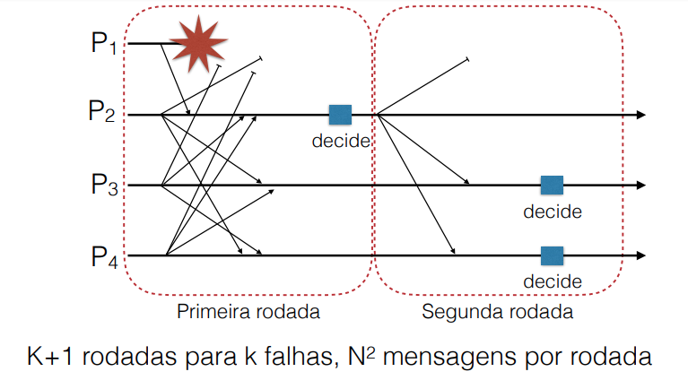

# Resliência de processos

**Organização**
- Planos: 
  - Todos os processos são iguais
  - Pedidos são tratados por todos
  - Não tem ponto único de falha
  - Mais processamento e latência elevada pois todos precisam concordar
- Hierárquicos
  - Tem um coordenador
  - Pedidos são tratados pelo coordenador. Ele resolve diretamente ou passa a tarefa para algum trabalhador
  - Simples, rápido e custa menos pois só um precisa tomar a decisão
  - Falha no coordenador pede uma nova eleição.
---------------------
**Gerência de Grupos**
- Processos entram e saem (ou falham)
- Podemos fazer a gerência por um coordenador ou por broadcast
- Todos devem sabem quem entra e quem sai
- O modelo de falha define o que esperar se um processo falha.
  - Se for failure-stop, todos vão saber que um processo saiu pq falhou
- Se o número de saídas for alto, o grupo pode ficar tão pequeno que não funciona mais
-----------------------
**Replicação para tolerância a falhas**
- Para o funcionamento do grupo, e essencial que todos concordem sobre o estado do grupo.
- Podemos usar técnicas anteriores:
  - Replicação baseada no primário (primary-backup)
  - Escrita replicada (active-replicarion). Todos funcionam como máquinas de estados replicadas
- Um grupo é **k-fault tolerante** se ele tolera K falhas
  - Crash-stop: K+1 processos
  - Crash-consistent (podem falhar, mas mandam mensagens consistente): 2K+1 processos
  - Bizantinos: 3K+1 processos
-----------------------
**Consenso**
- Todos vão trocar informação e decidir sobre uma determinada questão
- O importante é todos os processos chegem na mesma decisão
- **Sem Falhas**:
  - Todos trocam informações
  - Todos aplicam o mesmo algoritmo de decisão

**Crash Failures**
- Flooding Consensus
- A cada rodada, cada processo manda seus dados. Dessa forma cada processo tambem deve receber mensagem de todos os outros processos que estão funcionando. Todos usam o mesmo algortimo de decisão sobre os mesmos dados.
- Se um processo detecta uma falha (deixa de receber uma mensagem), ele passasa para a próxima rodade sem decidir.
- Em caso de falha:
  - Se pelo menos um processo recebe todos as mensagems, ele toma decisão e passa para os outros na próxima rodada
  - Na próxima rodada os outros processos conseguem todar uma decisão também

**Falhas Bizantinas**
- Para cada rodade temos um primário, e ele vai decidir qualque é o valor de consenso
- Todo processo que não falha vai receber o valor 
- Se o primário não falha, todos concordam
- Se o primário falha, todos os outros vão chegar em um mesmo valor mas esse valor pode variar o definido