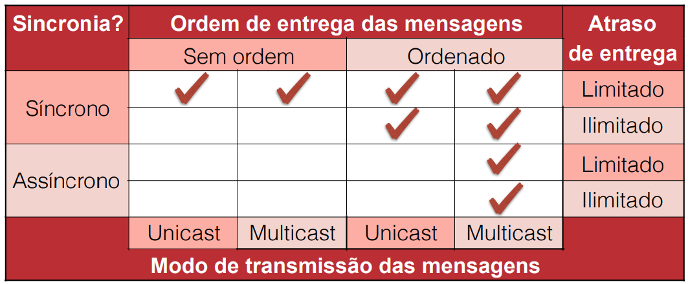

# Impossibilidades

## Requisitos de um consenso
Em um consenso precisamos de alguns requisitos:
- Do grupo de segurança
  - **Acordo** (agreement)
    - Todos os processos produzem o mesmo valor de saída
  - **Integridade** (integrity)
    - Todo o valor de saída deve ser válido
- Do grupo de Vivacidade - Garante que o sistema não para, vai evoluir até chegar em um resultado
  - **Terminação** (termination)
    - Eventualmente todos vão gerar um resultado

## Impossibilidade de consenso FLP (1985)

Nenhum consenso pode ser garantido em um sistema assíncrono na presença de qualquer falha.

O sistema pode ser seguro ou garantir que termina, não os dois.

É impossível garantir um consenso que não possa demorar para sempre.

**Solução**: Assumimos restrições
- Assumimos que o sistema pode parar de funcionar em casos extremos
- Para reduzir chances de falha, usamos sincronia parcial
  - Em último caso são assíncronos, mas na maioria dos casos temos tempos limitados
- **Mascaramento de falhas:** Assumem que processos que falham sempre se recuperam e voltam a funcionar
- **Detectores de falhas**: Determina uma probabilidade para um nó falhar se ele demorou mais do que um intervalo de tempo

## The Many Faces of Consensus in Distributed Systems (1992)

Loop de confirmações infinito.

Dimensões para o problema:
- Síncrono ou assíncrono ?
- Comunicação tem atraso limitado ?
- Mensagens são entregas em ordem ?
- Mensagens podem ser enviada em multicast ?

## CAP 

- **C**osnsistencia (forte): Todos os nós veem os mesmos dados ao mesmo tempo
- Disponibilidade (**A**vailability): Falhas de nós não impedem demais de continuar operando
- Toletante a **P**articionamento: O sistema continar funionando mesmo se for partido em dois grafos sem comunicação

Dessas 3 propriedades, só conseguimos ter duas ao mesmo tempo

- CP: Protocolos de quorum onde partições menores não param 
  - Paxos
- CA: Protocolos de quorum estritos (two-phase commit)
  - 2PC
- AP: Protocolos que usam resolução de conflitos para atualização dos dados
  - Gossip

Na internet temos **Partições** obrigatoriamente, então temos que navegar entre garantir Disponibilidade ou Consistência.