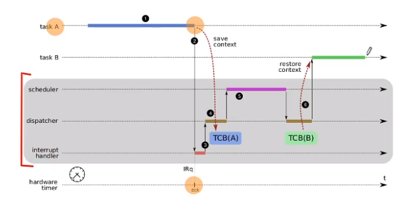

# Gestão de tarefas - Implementação de tarefas

## Contexto

**Contexto**: Um estado de uma tarefa. Cada tarefa possui um contexto próprio com variáveis, *program counter*, *stack pointer* e outros dados necessários para sua execução.

Informações do contexto:
1. Registradores do processador
   1. Program Counter: indica a posição da execução
   2. Stack Pointer: topo da pilha de execução
   3. Demais registradores: Acumulador etc...
   4. Flags: nível de usuário/núcleo, status, etc...
2. Áreas de memória usadas pela tarefa
3. Recursos em uso:
   1. Arquivos abertos
   2. Conexores de rede
   3. Semáforos
   4. ...

**TCB - Task Control Block**: Um struct que contem as informações da tarefa. Possui dados como:
1. Identificador da tarefa
2. Estado: New/Ready/Running...
3. Contexto
4. Recursos usados
5. Informações de contabilização: Data de início, tempo de processamento, etc...
6. Outras info: prioridade, proprietário, etc...

## Troca de contexto

**Troca de contexto** é trocar uma tarefa em execução por outra. Isso significa salvar o contexto atual, escolher a próxima tarefa e restaurar seu contexto.

**Despachante (mecanismo)**: Implementa a troca. Ele que sabe como tirar uma tarefa da CPU, como salvar o contexto e como restaurar um contexto.

**Escalonador (política)**: Avalia as tarefas prontas e define a ordem de execução.

## Processos

**Processos**: capsulas de recursos utilzados para executar tarefas.

Um processo contém:
1. Áreas de memórias 
2. Descritores de recursos
3. Uma ou mais tarefas em execução

Os processos são isolados entre si pelo hardware usando áreas de memória e níveis de operação (kernel/user).

**Criação de Processos**: é feito através de uma chamada de sistema.

No sistema UNIX, a criação ocorre com o `fork()`, que para o processo pai e copia todo o conteúdo do processo para uma nova área de memória, então temos dois processos idênticos que estão parados. Os dois vão retornar na mesma posição de código.

Podemo usar o `execve(file)` para substituir o código atual por outro especificado no `file`.

## Threads

**Theread** é um fluxo de execução dentro de um processo, ou dentro do núcleo do sistema operacional. Por *default* cada processo possui uma thread.

Temos dois tipos:
1. Thread de usuário: Fluxos dentro de um processo, assiciados à execução da aplicação.
1. Thread de núcleo: fluxos dee execução dentro do núcleo.

Temos 3 formas de implementação de threads:
1. N:1
   - Mais de uma thread de usuário para uma thread de kernel.
   - Uso de bibliotecas de thread para a gerência. 
   - Bom para aplicações de muitas threads.
   - Modelo leve e de fácil implementação.
2. 1:1
   - Cada thread de usuário usa uma thread de kernel.
   - Complixcade de usar pelo limite do número de threads.
   - Gerencia **é** implementada no núcleo.
3. N:M
   - Posso ter um conjuntos de threads de usuários para um conjunto de threads de kernel
   - O uso de bibliotecas de thread que podem pedir a criação de várias de threads de kernel.
   - Implementação mais complexa.

| Modelo               | N:1                 | 1:1                    | N:M                 |
| -------------------- | ------------------- | ---------------------- | ------------------- |
| Implementação        | Biblioteca          | núcleo                 | ambos               |
| Complexidade         | baixa               | média                  | alta                |
| Custo de gerência    | nulo                | médio                  | alto                |
| Escalabilidade       | alta                | baixa                  | alta                |
| Vários Processadores | não                 | sim                    | sim                 |
| Troca de contexto    | rápida              | lenta                  | depende da situação |
| Divisão de recursos  | injusta             | justa                  | variável            |
| Exemplos             | Python, GNU Threads | Linux, Windows, Mac OS | Solaris, FreeBSD    |

