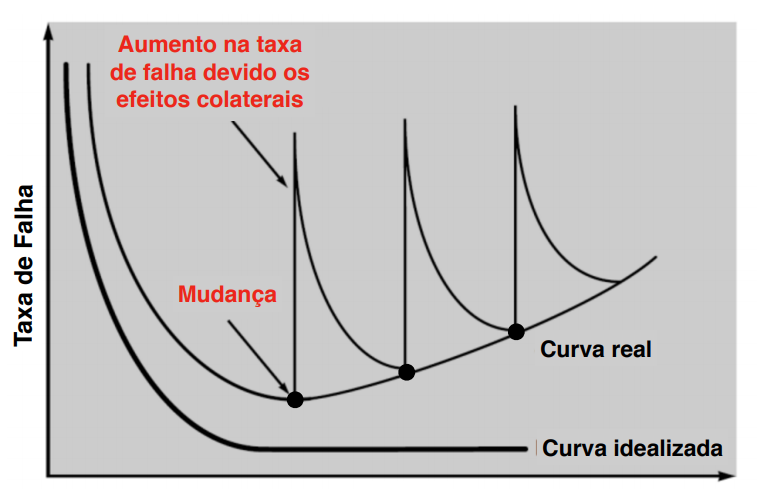

# Introdução

## O que e software

Programa + documentação.

## Caracteristicas principais

Ele é lógico, não se desgasta mas se deteriora.

## Curva de falha de hardware

É acentuada no início e no fim, pela mortalidade infantil e desgaste com o tempo. Chamada também de curva da banheira

## Curva de falha de Software

No geral ela costuma a crescer se nenhuma atitude for tomada para manter qualidade

## Mudanças de Software

Mudanças ocorem ao longo do tempo para:
- **Adicionar** novas funcionalidades
- **Refatorar** código (melhorar qualidade)
- **Corrigir** defeitos (o que pode gerar novos defeitos)

## Crise de Software (anos 60)

Grande demandar por software, mas não existiam métodos de engenharia de software polidos. Isso acabava gerando muitos softwares sem qualidade.

... n anotei mais