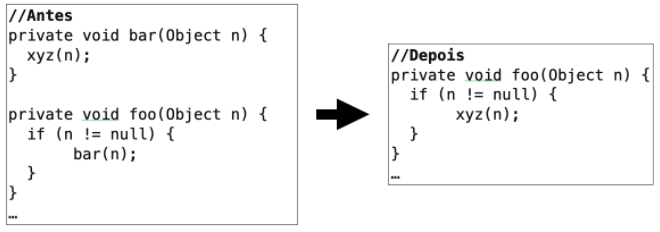
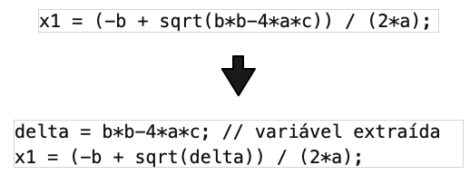

# Refatoração: introdução

Refactoring mantem o comportamento do código e melhora de manutenibilidade/qualidade

## Extract Method

- Objetivo: extrair um trecho de código e leva-lo para um novo método
- Motivações:
  - Reuso
  - Decomposição em métodos menores
  - introduzir uma assinatura alternativa
  - facilitar teste
  - permitir redefinição do método extraído em subclasses
  - remover duplicação

## Inline Method

- Objetivo: Apagar métodos que são extremamente triviais
- Bem menos frequente

## Move Method

- Mover um método entre classes para aumentar a coesão e reduzir acoplamento.
- Quando um método faz mais sentido em uma classe do que outra.
- Para não afetar o cliente podemos mover um método mas manter a chamada na classe antiga apenas chamando a classe nova.

- Pode ser usado como:
  - **Pull Up Method**: Subir o método para uma superclasse
  - **Push Down Method**: Move para baixo na hierarquia de classes

## Extract Class

- Quando um sistema possui uma classe A com muitas responsabilidades podemos extrair uma nova classe para reduzir as responsabilidades da classe original.
- Reusabilidade
- Melhor Testabilidade

## Rename

- Mais amplamente adotada.
- Renomear uma classe, função ou variável.
- o problema é atualizar os pontos do código que chamam o elemento renomeado.
  - Seria interessante manter o nome antigo, mas depreciado (apenas delega para o novo método)

# Outros Refactoring 

Aqui focamos no **escopo local**

## Extração de Variaveis

- Simplificar expreções para tornar mais simples de ler.

## Remoção de Flags

- USar break ou return para retirar variáveis de flags ( tipo o "achou" dentro de um while)

## Substituição de Condicional por Polimorfismo

- Simplificação de comandos condicionais em OO
- Trocar um switch por uma função com polimorfismo

____________________________________________________________________________

# Analisando as afirmativas sobre refactoring, é INCORRETO afirmar:

Escolha uma:
- Refactoring pode melhorar modularidade e projeto, mas não testabilidade. 
- Refactoring transforma o código com foco na melhoria de qualidade.
- Refactoring não introduz bugs nem novas funcionalidades.
- Refactoring sempre preserva comportamento.
- Refactoring pode ser definido como: "Transformação de código, que preserva comportamento e que melhora a manutenibilidade de um sistema"

A resposta correta é: Refactoring pode melhorar modularidade e projeto, mas não testabilidade..

#  Refactoring altera o código para melhorar sua qualidade interna, mas não muda o seu comportamento.

Escolha uma opção:
- Verdadeiro 
- Falso

A resposta correta é 'Verdadeiro'.

# Refactorings melhoraram o desempenho e a segurança de um sistema.

Escolha uma opção:
- Verdadeiro
- Falso 

A resposta correta é 'Falso'.

# Seja o trecho de código da figura a seguir. Qual refatoração está sendo aplicada?

Escolha uma:
- Inline de método 
- Movimentação de método
- Descer método
- Extração de método
- Subir método

Sua resposta está correta.
A resposta correta é: Inline de método.

# Sobre a extração de métodos, marque a alternativa INCORRETA:

Escolha uma:
- Extração de métodos facilita a criação de novas classes.
- Extração de métodos facilita a decomposição de métodos longos.
- Extração de métodos evita duplicação de código
- Extração de métodos melhora o reúso e a testabilidade do sistema.
- Extração de métodos fornece diversas vantagens ao desenvolvedor. 

Sua resposta está incorreta.
A resposta correta é: Extração de métodos facilita a criação de novas classes..

# Assim como a extração de métodos, o refactoring subir método (pull up method) também evita duplicação de código.

Escolha uma opção:
- Verdadeiro 
- Falso

A resposta correta é 'Verdadeiro'.

# Extração de métodos fornece vários benefícios, tais como decomposição, reúso e remoção de duplicação.

Escolha uma opção:
- Verdadeiro 
- Falso

A resposta correta é 'Verdadeiro'.

# Movimentação de métodos pode melhorar a coesão do projeto, mas não o acoplamento.

Escolha uma opção:
- Verdadeiro
- Falso 

A resposta correta é 'Falso'.

# O refactoring abaixo é usado para simplificar expressões.

Escolha uma opção:
- Verdadeiro 
- Falso

A resposta correta é 'Verdadeiro'.

# Refatoração deve ser feita em pequenos passos, pois se erros forem cometidos, fica mais fácil de encontrar o problema.

Escolha uma opção:
- Verdadeiro 
- Falso

A resposta correta é 'Verdadeiro'.