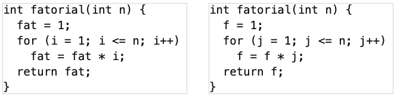
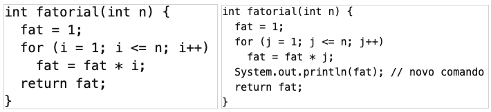

# Marque as alterativas corretas.

- Quando uma classe cresce tanto que ela passa a monopolizar grande parte da “inteligência” de um sistema.	
- Método que parece “invejar” os dados e métodos de uma outra classe
- Principal code smell 
- Apenas atributos e nenhum método.

**A resposta correta é**: Quando uma classe cresce tanto que ela passa a monopolizar grande parte da “inteligência” de um sistema. → God Class, Método que parece “invejar” os dados e métodos de uma outra classe → Feature Envy, Principal code smell → Código Duplicado, Apenas atributos e nenhum método. → Classes de Dados.

# Marque a alternativa CORRETA sobre code smells:

Escolha uma:
- Métodos longos tornam o código mais difícil de entender, mas não de manter.
- Frequentemente, é mais fácil reusar classes grandes.
- Feature envy trata de métodos que parecem "invejar" os dados e métodos de uma outra classe. 
- Métodos com muitos parâmetros não é um code smell.
- Extração de classe quebra classes grandes em duas outras classes.

A resposta correta é: Feature envy trata de métodos que parecem "invejar" os dados e métodos de uma outra classe..

# A duplicação abaixo é do tipo 2, pois envolve a renomeação de variáveis.

Escolha uma opção:
Verdadeiro 
Falso

A resposta correta é 'Verdadeiro'.

# Além de pequenos, idealmente, métodos devem ter poucos parâmetros.

Escolha uma opção:
- Verdadeiro 
- Falso

A resposta correta é 'Verdadeiro'.

# Código duplicado  aumenta o esforço de manutenção, pois manutenções têm que ser realizadas em n partes do código.

Escolha uma opção:
- Verdadeiro 
- Falso

A resposta correta é 'Verdadeiro'.

# Código Duplicado, Métodos Longos e Classes Grandes são exemplos de Code Smells.

Escolha uma opção:
- Verdadeiro 
- Falso

A resposta correta é 'Verdadeiro'.

# Existem três tipos de código duplicado: tipo 1, tipo 2 e tipo 3.

Escolha uma opção:
- Verdadeiro
- Falso 

A resposta correta é 'Falso'.

# Extract Method e Extract Class são formas de eliminar duplicação.

Escolha uma opção:
- Verdadeiro 
- Falso

A resposta correta é 'Verdadeiro'.

# O clone abaixo é do tipo 3, pois envolve mudanças de comandos.

Escolha uma opção:
- Verdadeiro 
- Falso

A resposta correta é 'Verdadeiro'.

# Trechos de código com code smells são candidatos a refatoração.

Escolha uma opção:
- Verdadeiro 
- Falso

A resposta correta é 'Verdadeiro'.