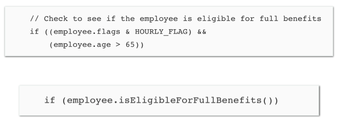
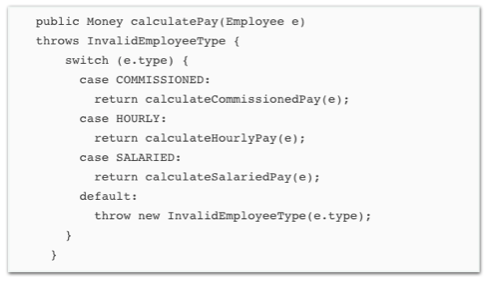
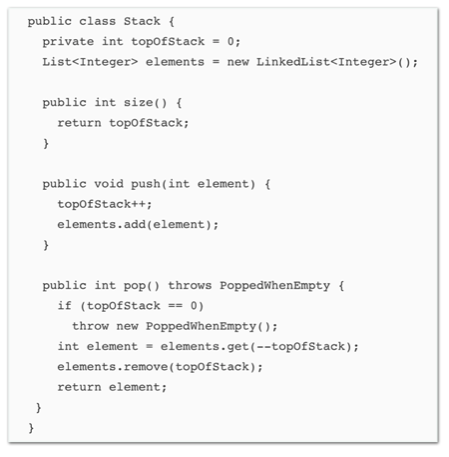

# Qual dos trechos de código abaixo é a melhor segundo as práticas de código limpo?

Escolha uma:
- Código acima, pois possui comentários.
- Código abaixo, pois é auto explicativo. 

Sua resposta está correta.
A resposta correta é: Código abaixo, pois é auto explicativo..

# Devemos nomear variáveis, métodos, argumentos, etc com nomes que revelam a intenção.

Escolha uma opção:
- Verdadeiro 
- Falso

A resposta correta é 'Verdadeiro'.

# O propósito dos comentários é compensar a falha de nos expressarmos em código, logo, todo trecho de código deve ser comentando.

Escolha uma opção:
- Verdadeiro
- Falso 

A resposta correta é 'Falso'.

# Duplicação é a raiz de diversos problemas na manutenção de software.

Escolha uma opção:
- Verdadeiro 
- Falso

A resposta correta é 'Verdadeiro'.

# Funções com poucos parâmetros tendem a ser mais fáceis de testar que funções com muitos parâmetros. Logo, devemos buscar escrever funções com menos parâmetros.

Escolha uma opção:
- Verdadeiro 
- Falso

A resposta correta é 'Verdadeiro'.

# O principal problema da função abaixo é que diversas funções terão a mesma estrutura, gerando um problema de duplicação de código.

Escolha uma opção:
- Verdadeiro 
- Falso

A resposta correta é 'Verdadeiro'.

# A simples mudança de tipo de um parâmetro pode quebrar o contrato de uma interface.

Escolha uma opção:
- Verdadeiro 
- Falso

A resposta correta é 'Verdadeiro'.

# Testes de unidade devem ser rápidos e dependentes.

Escolha uma opção:
- Verdadeiro
- Falso 

A resposta correta é 'Falso'.

# Testes limpo seguem os mesmo princípios de código limpo, por exemplo, boa legibilidade, baixa complexidade, sem duplicação, etc.

Escolha uma opção:
- Verdadeiro 
- Falso

A resposta correta é 'Verdadeiro'.

# A classe abaixo possui baixa coesão pois o método size() acessa apenas o atributo topOfStack.

Escolha uma opção:
- Verdadeiro
- Falso 

A resposta correta é 'Falso'.

# Classes devem seguir o princípio da Responsabilidade Única (SRP).

Escolha uma opção:
- Verdadeiro 
- Falso

A resposta correta é 'Verdadeiro'.

# Para manter alta coesão, classes com baixa coesão devem devem ser divididas em classes menores.

Escolha uma opção:
- Verdadeiro 
- Falso

A resposta correta é 'Verdadeiro'.