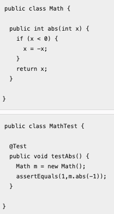

# Cobertura de testes mede o percentual de código não coberto por testes.

Escolha uma opção:
- Verdadeiro
- Falso 

A resposta correta é 'Falso'.

# Devemos sempre buscar cobertura de 100%.

Escolha uma opção:
- Verdadeiro
- Falso 

A resposta correta é 'Falso'.

# Em geral, cobertura tende a variar por linguagem de programação.

Escolha uma opção:
- Verdadeiro
- Falso 

A resposta correta é 'Verdadeiro'.

# Em geral, não precisamos ter cobertura de 100%, pois sempre existem métodos triviais em um sistema; por exemplo, getters e setters. Também sempre temos métodos cujo teste é mais desafiador, como métodos de interface com o usuário ou métodos com comportamento assíncrono.
- Escolha uma opção:
- Verdadeiro 
Falso

A resposta correta é 'Verdadeiro'.

# Linha amarela indica que o comando é um desvio e que apenas um dos caminhos possíveis do desvio foi exercitado pelos testes de unidade.
Escolha uma opção:
- Verdadeiro 
- Falso

A resposta correta é 'Verdadeiro'.

# Linhas verdes são cobertas pela execução dos testes.
Escolha uma opção:
Verdadeiro 
- Falso

A resposta correta é 'Verdadeiro'.

# No código abaixo, temos 100% de cobertura de comandos.

Escolha uma opção:

- Verdadeiro
- Falso 

A resposta correta é 'Verdadeiro'.

# Times que valorizam a escrita de testes costumam atingir facilmente valores de cobertura próximos de 50%.
Escolha uma opção:
- Verdadeiro 
- Falso

A resposta correta é 'Falso'.