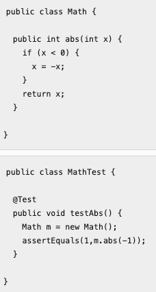
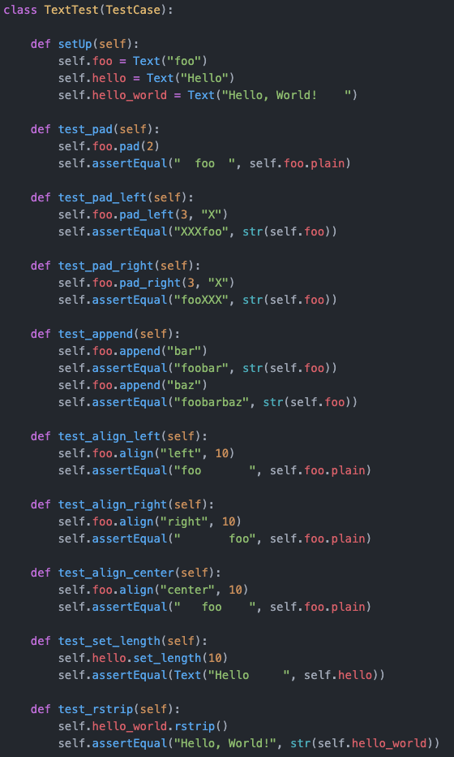
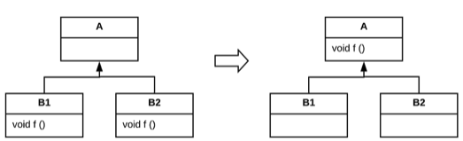
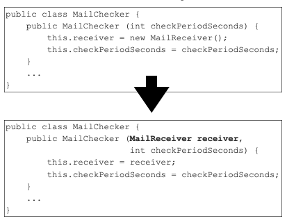

# Cobertura de testes mede o percentual de código não coberto por testes.

Escolha uma opção:
- Verdadeiro
- Falso 

 A resposta correta é 'Falso'. 

# Devemos sempre buscar cobertura de 100%.

Escolha uma opção:
- Verdadeiro
- Falso 

 A resposta correta é 'Falso'. 

# Em geral, cobertura tende a variar por linguagem de programação.

Escolha uma opção:
- Verdadeiro
- Falso 

 A resposta correta é 'Verdadeiro'. 

# Em geral, não precisamos ter cobertura de 100%, pois sempre existem métodos triviais em um sistema; por exemplo, getters e setters. Também sempre temos métodos cujo teste é mais desafiador, como métodos de interface com o usuário ou métodos com comportamento assíncrono.
- Escolha uma opção:
- Verdadeiro 
Falso

 A resposta correta é 'Verdadeiro'. 

# Linha amarela indica que o comando é um desvio e que apenas um dos caminhos possíveis do desvio foi exercitado pelos testes de unidade.
Escolha uma opção:
- Verdadeiro 
- Falso

 A resposta correta é 'Verdadeiro'. 

# Linhas verdes são cobertas pela execução dos testes.
Escolha uma opção:
Verdadeiro 
- Falso

 A resposta correta é 'Verdadeiro'. 

# No código abaixo, temos 100% de cobertura de comandos.

Escolha uma opção:

- Verdadeiro
- Falso 

 A resposta correta é 'Verdadeiro'. 

# Times que valorizam a escrita de testes costumam atingir facilmente valores de cobertura próximos de 50%.
Escolha uma opção:
- Verdadeiro 
- Falso

 A resposta correta é 'Falso'. 

# Trechos de código com test smells são candidatos a refatoração.

Escolha uma opção:
- Verdadeiro 
- Falso

 A resposta correta é 'Verdadeiro'. 

# Devemos evitar testes com fixtures genéricas.

Escolha uma opção:
- Verdadeiro 
- Falso

 A resposta correta é 'Verdadeiro'. 

# Existem casos onde justifica-se ter mais de um assert por método de teste.
Escolha uma opção:
- Verdadeiro 
- Falso

 A resposta correta é 'Verdadeiro'. 

# Sleepy Test é um test smell.

Escolha uma opção:
- Verdadeiro 
- Falso

 A resposta correta é 'Verdadeiro'. 

# Testes longos e complexos representam um Test Smell, mas os desenvolvedores não devem tentar refatorar os testes para evitar que eles quebrem.

Escolha uma opção:
- Verdadeiro
- Falso 

 A resposta correta é 'Falso'. 

# Trechos de código com code smells são candidatos a refatoração.

Escolha uma opção:
- Verdadeiro 
- Falso

 A resposta correta é 'Verdadeiro'. 

# A única forma para se criar objetos mocks é através de frameworks de mocks, tais como Mockito, Jest e Simon.JS.

Escolha uma opção:
- Verdadeiro
- Falso 

 A resposta correta é 'Falso'. 

# Mocks devem ser utilizados apenas para isolar testes de sistema.

Escolha uma opção:
- Verdadeiro 
- Falso

 A resposta correta é 'Falso'. 

# Mocks facilitam a escrita de testes de unidade, pois eliminam dependências difíceis de serem recriadas em um teste.

Escolha uma opção:
- Verdadeiro 
- Falso

 A resposta correta é 'Verdadeiro'. 

# Mocks podem aumentar o acoplamento entre o teste e o método testado.

Escolha uma opção:
- Verdadeiro 
- Falso

 A resposta correta é 'Verdadeiro'. 

# Mocks são objetos que “emulam” o objeto real, mas apenas para permitir o teste.

Escolha uma opção:
- Verdadeiro 
- Falso

 A resposta correta é 'Verdadeiro'. 

# Podemos criar objetos mocks com auxílio de frameworks ou "manualmente", através de classes de mocks.

Escolha uma opção:
- Verdadeiro 
- Falso

 A resposta correta é 'Verdadeiro'. 

# Dummy trata de objetos que são passados mas nunca utilizados.

Escolha uma opção:
- Verdadeiro
- Falso 

 A resposta correta é 'Verdadeiro'. 

# Fake possui comportamento de negócio.

Escolha uma opção:
- Verdadeiro 
- Falso

 A resposta correta é 'Verdadeiro'. 

# Mocks formais sabem o que estão testando.

Escolha uma opção:
- Verdadeiro 
- Falso

 A resposta correta é 'Verdadeiro'. 

# Spies são stubs que registram algumas informações baseados em como foram chamados.

Escolha uma opção:
- Verdadeiro 
- Falso

 A resposta correta é 'Verdadeiro'. 

# Stubs fornecem respostas “prontas” para chamadas realizadas no teste.

Escolha uma opção:
- Verdadeiro 
- Falso

 A resposta correta é 'Verdadeiro'. 

# Teste de Regressão garante que alterações não introduzam comportamentos inesperados ou novos erros.

Escolha uma opção:
- Verdadeiro <
- Falso

# Testes de unidade devem ser executados de forma rápida e frequente. Desenvolvedores devem rodar os testes unidades sempre depois de toda alteração no código pois, caso alguma regressão tenha sido inserida, o feedback será quase que imediato.

Escolha uma opção:
- Verdadeiro <
- Falso

# Testes de unidade devem ter sempre o mesmo resultado (ou eles sempre passam ou eles sempre falham). Ou seja, testes de unidade devem ser determinísticos.

Escolha uma opção:
- Verdadeiro <
- Falso

# Testes Flaky possuem resultados não-determinísticos.

Escolha uma opção:
- Verdadeiro <
- Falso

# Testes Flaky são muito raros e sua resolução é trivial.

Escolha uma opção:
- Verdadeiro
- Falso <

# Testes devem expressar o comportamento testado de forma clara.

Escolha uma opção:
- Verdadeiro <
- Falso

# Falhas inesperadas podem ter valor, pois revelam relacionamentos implícitos no código.

Escolha uma opção:
- Verdadeiro <
- Falso

# Código de teste é tão importante quanto de produção.

Escolha uma opção:
- Verdadeiro <
- Falso

# A seguinte estrutura é comum em métodos de teste: setup/execute/verify/teardown.

Escolha uma opção:
- Verdadeiro <
- Falso

# É uma boa prática nomear métodos de testes de acordo com o método que está sendo exercitado.

Escolha uma opção:
- Verdadeiro <
- Falso

# É uma boa prática de testes:

Escolha uma:
- a. Escrever testes fáceis de entender e manter. <
- b. Escrever testes com lógica condicional para cobrir vários cenários.
- c. Escrever testes com pelo menos 10 comandos asserts.
- d. Escrever testes longos para simplificar o processo de criação dos testes.
- e. Escrever testes com duplicação.

# Sobre teste de unidade e integração, marque a alternativa CORRETA:

Escolha uma:
- a. Testes de unidade testam unidades de modo dependente.
- b. Testes de integração podem envolver diversas classes ou pacotes distintos, e exercitam um serviço completo do sistema. <
- c. Testes de unidade podem ser rodados de forma automatizada ou manual.
- d. Testes de integração são mais rápidos que os testes de unidade.
- e. Testes de integração necessitam de frameworks especiais para serem rodados.

# Considerando o teste abaixo, responda:

1. Qual o tipo de teste apresentando no código (de acordo com pirâmide de testes)? 

2. Justifique as razões para a escolha do teste (com base no código).

3. Qual a fixture do teste?

4. Quantas vezes a fixture será executada?

#  Refactoring altera o código para melhorar sua qualidade interna, mas não muda o seu comportamento.

Escolha uma opção:
- Verdadeiro 
- Falso

 A resposta correta é 'Verdadeiro'. 

# Refactoring sempre preserva o comportamento do código modificado.

Escolha uma opção:
- Verdadeiro 
- Falso

 A resposta correta é 'Verdadeiro'. 

# Refactorings melhoraram o desempenho e a segurança de um sistema.

Escolha uma opção:
- Verdadeiro
- Falso 

 A resposta correta é 'Falso'. 

# Antes que iniciar qualquer refatoração, é importante ter um conjunto sólido de testes.

Escolha uma opção:
- Verdadeiro 
- Falso

 A resposta correta é 'Verdadeiro'. 

# Assim como a extração de métodos, o refactoring subir método (pull up method) também evita duplicação de código.

Escolha uma opção:
- Verdadeiro 
- Falso

 A resposta correta é 'Verdadeiro'. 

# Existem refactorings que melhoraram, por exemplo, a implementação interna de um único método (escopo local).
Escolha uma opção:
- Verdadeiro 
- Falso

 A resposta correta é 'Verdadeiro'. 

# Extração de métodos fornece vários benefícios, tais como decomposição, reúso e remoção de duplicação.

Escolha uma opção:
- Verdadeiro 
- Falso

 A resposta correta é 'Verdadeiro'. 

# Na renomeação, a parte mais complexa não é renomear o elemento, mas atualizar os pontos do código em que ele é referenciado.

Escolha uma opção:
- Verdadeiro 
- Falso

 A resposta correta é 'Verdadeiro'. 

# O refactoring abaixo é denominado Subir Atributo.

Escolha uma opção:
- Verdadeiro
- Falso 

 A resposta correta é 'Falso'. 

# Refatoração deve ser feita em pequenos passos, pois se erros forem cometidos, fica mais fácil de encontrar o problema.

Escolha uma opção:
- Verdadeiro 
- Falso

 A resposta correta é 'Verdadeiro'. 

# Analisando as afirmativas sobre Testes de Software, é INCORRETO afirmar que:

Escolha uma:
- Teste de Unidade é o tipo mais comum de teste.
- Testes de unidade são implementados usando-se frameworks de teste, tais como JUnit, unittest, entre outros.
- Grande parte dos testes, hoje em dia, são automatizados.
- Métodos de testes devem ser públicos para o framework de teste e podem conter parâmetros. 
- Hoje em dia, não existem mais grandes equipes de testes. Normalmente, o desenvolvedor que implementa uma classe também implementa seus testes.

A resposta correta é: Métodos de testes devem ser públicos para o framework de teste e podem conter parâmetros..

# A Pirâmide de Testes classifica os testes em: Testes de Unidade, Testes de Integração e Testes de Sistema. Testes de Unidade estão localizados no topo, enquanto Testes de Sistema na base da pirâmide.

Escolha uma opção:
- Verdadeiro
- Falso 

 A resposta correta é 'Falso' 

# Código sem teste possui baixa qualidade, pois não temos como garantir que regressões não foram inseridas no sistema após a realização de uma modificação no código.

Escolha uma opção:
- Verdadeiro 
- Falso

 A resposta correta é 'Verdadeiro' 

# O único objetivo do Teste de Software é evitar que erros cheguem aos usuários finais.

Escolha uma opção:
- Verdadeiro
- Falso 

 A resposta correta é 'Falso' 

# Sobre Teste de Unidade, é CORRETO afirmar: 

Escolha uma:
a. Testes de unidade detectam apenas regressões.
b. Testes de unidade são importantes para detectar bugs ainda na fase de desenvolvimento, mas não detectam regressões.
c. Testes de unidade podem ser rodados de forma automatizada ou manual.
d. Testes de unidade testam unidades de modo dependente.
e. Um teste de unidade T é um  programa que chama métodos  de uma classe C e verifica se  eles retornam os resultados  esperados. 

A resposta correta é: Um teste de unidade T é um  programa que chama métodos  de uma classe C e verifica se  eles retornam os resultados  esperados..

# A fixture do teste "fixa" o estado do sistema que será testado pelos métodos de teste. A fixture é executada apenas uma vez para cada classe de teste.

Escolha uma opção:
- Verdadeiro 
- Falso

 A resposta correta é 'Falso' 

# Classes de testes devem seguir algumas convenções. Por exemplo, classes de testes devem possuir o prefixo "Test", enquanto métodos de testes devem começar com o prefixo "test".

Escolha uma opção:
- Verdadeiro 
- Falso

 A resposta correta é 'Falso' 

# O SUT representa o sistema que está sendo testado.

Escolha uma opção:
- Verdadeiro 
- Falso

 A resposta correta é 'Verdadeiro' 

# Testes de unidade são testes automatizados de pequenas unidades de código (ex: classes, métodos, funções, etc) que são testadas de forma independente do sistema.

Escolha uma opção:
- Verdadeiro 
- Falso

 A resposta correta é 'Verdadeiro' 

# Um dos benefícios do Teste de unidade é encontrar bugs após o sistema entrar em produção.

Escolha uma opção:
- Verdadeiro
- Falso 

 A resposta correta é 'Falso' 

# Sobre Testes de Integração, é CORRETO afirmar: 

Escolha uma:
- Testes de integração necessitam de frameworks especiais para serem rodados.
- Testes de integração são testes independentes.
- Testes de integração podem envolver diversas classes ou pacotes distintos, e exercitam um serviço completo do sistema. 
- Testes de integração são mais rápidos que os Testes de Unidade.
- Testes de integração são mais caros que os Testes de Sistema.

Sua resposta está correta.
A resposta correta é: Testes de integração podem envolver diversas classes ou pacotes distintos, e exercitam um serviço completo do sistema..

# Testes de integração testam unidades dos sistemas de forma independente.

Escolha uma opção:
- Verdadeiro
- Falso 

 A resposta correta é 'Falso'. 

# Testes de sistema focam na uso do sistema sob o ponto de vista do usuário. Logo, tais testes são mais baratos, rápidos e robustos.

Escolha uma opção:
- Verdadeiro
- Falso 

 A resposta correta é 'Falso'. 

# Sobre teste de software, marque a alternativa CORRETA:

Escolha uma:
- Testes Caixa Branca são escritos com base apenas na interface do sistema sob testes.
- Testes de integração são mais caros que os testes de aceitação.
- Testes Caixa Preta considera informações sobre o código e a estrutura do sistema sob teste.
- Métodos de testes devem ser públicos para o framework de teste. 
- Métodos de testes podem conter parâmetros.

Sua resposta está correta.
A resposta correta é: Métodos de testes devem ser públicos para o framework de teste..

# A verificação testa se fizemos o sistema corretamente, isto é, de acordo com a sua especificação/requisitos.
Escolha uma opção:
- Verdadeiro 
- Falso

 A resposta correta é 'Verdadeiro'. 

# Teste de aceitação ocorre quando o sistema é modificado ou novo módulo é adicionado.

Escolha uma opção:
- Verdadeiro
- Falso 

 A resposta correta é 'Falso'. 

# Teste de unidade/integração/sistema faz a validação, enquanto teste de aceitação a verificação.

Escolha uma opção:
- Verdadeiro
- Falso 

 A resposta correta é 'Falso'. 

# Testes Caixa Branca são escritos sem o conhecimento do código.
Escolha uma opção:
- Verdadeiro
- Falso 

 A resposta correta é 'Falso'. 

# Testes Caixa Preta são escritos com base apenas na interface do sistema sob testes.

Escolha uma opção:
- Verdadeiro
- Falso 

 A resposta correta é 'Verdadeiro'. 

# Testes de Aceitação determina se o cliente está de acordo ou não com a implementação realizada.

Escolha uma opção:
- Verdadeiro 
- Falso

 A resposta correta é 'Verdadeiro'. 

# Analisando as afirmativas sobre o princípio FIRST, é INCORRETO afirmar:

Escolha uma:
- Testes de unidade devem ter sempre o mesmo resultado, ou seja, eles devem ser determinísticos.
- Desenvolvedores devem executar testes de unidades frequentemente para obter feedback imediato.
- A ordem de execução dos testes de unidade é importante. 
- Se possível, testes devem ser escritos antes mesmo do código que vai ser testado.
- O resultado do teste de unidade deve ser facilmente verificável.

A resposta correta é: A ordem de execução dos testes de unidade é importante..

# A ordem de execução dos testes unidade é importante e deve ser considerada pelo desenvolvedor. Por exemplo, um teste de unidade TA pode alterar alguma parte do estado global do sistema que será consumida por um teste TB, logo TA deve rodado após TB.

Escolha uma opção:
- Verdadeiro
- Falso 

 A resposta correta é 'Falso'. 

# As propriedades do princípio FIRST são: rápidos, independentes, determinísticos, auto-verificáveis e escritos o quanto antes.

Escolha uma opção:
- Verdadeiro 
- Falso

 A resposta correta é 'Verdadeiro'. 

# Devemos buscar testes pequenos e focados, com nomes legíveis, para melhorar o diagnóstico do teste.

Escolha uma opção:
- Verdadeiro 
- Falso

 A resposta correta é 'Verdadeiro'. 

# Devemos nomear os métodos de testes em termos de funcionalidades que o objeto alvo fornece.

Escolha uma opção:
- Verdadeiro 
- Falso

 A resposta correta é 'Verdadeiro'. 

# Métodos asserts geralmente possuem uma versão onde é possível indicar a mensagem apresentada em caso de falha.

Escolha uma opção:
- Verdadeiro 
- Falso

 A resposta correta é 'Verdadeiro'. 

# Os fatores que tornam o teste limpo são diferentes dos que tornam o código de produção limpo.

Escolha uma opção:
- Verdadeiro
- Falso 

 A resposta correta é 'Falso'. 

# Os nomes dos testes devem não descrever funcionalidades.

Escolha uma opção:
- Verdadeiro
- Falso 

 A resposta correta é 'Falso'. 

# Para facilitar o entendimento do teste, devemos sempre escrever um assert por método de teste.
Escolha uma opção:
- Verdadeiro 
- Falso

 A resposta correta é 'Falso'. 

# Uma falha deve claramente indicar o que falhou e porque. Desse modo, podemos rapidamente diagnosticar e corrigir o código.

Escolha uma opção:
- Verdadeiro 
- Falso

 A resposta correta é 'Verdadeiro'. 

# No TDD, o teste de unidade deve ser escrito antes do seu código de produção. O ciclo do TDD pode ser resumido em dois estados: vermelho e verde.

Escolha uma opção:
- Verdadeiro
- Falso 

 A resposta correta é 'Falso'. 
# O cliclo do TDD pode ser resumido em: vermelho, verde e refatorar.

Escolha uma opção:
- Verdadeiro 
- Falso

 A resposta correta é 'Verdadeiro'. 
# Sistemas que usam TDD tendem a ter alta testabilidade e cobertura de testes.

Escolha uma opção:
- Verdadeiro 
- Falso

 A resposta correta é 'Verdadeiro'. 
# TDD ajuda no Design for Testability. Como o desenvolvedor sabe que ele terá que escrever o teste T e depois a classe C, é natural que desde o início ele planeje C de forma a facilitar a escrita de seu teste. 

Escolha uma opção:
- Verdadeiro
- Falso 

 A resposta correta é 'Verdadeiro'. 
# TDD é uma prática de programação proposta por Extreme Programming (XP).

Escolha uma opção:
- Verdadeiro
- Falso 

 A resposta correta é 'Verdadeiro'. 

# Design for Testability fala que o projeto do SUT deve facilitar a escritas dos testes.

Escolha uma opção:
- Verdadeiro 
- Falso

 A resposta correta é 'Verdadeiro'. 

# Devemos escrever testes com qualidade. No entanto, o projeto da aplicação também deve favorecer a implementação de testes. Ou seja, deve haver um esforço tanto no lado dos testes quando no lado da aplicação.

Escolha uma opção:
- Verdadeiro 
- Falso

 A resposta correta é 'Verdadeiro'. 

# O esforço para escrita de bons testes deve ser alocado apenas no projeto do teste.
Escolha uma opção:
- Verdadeiro
- Falso 

 A resposta correta é 'Falso'. 

# TDD ajuda no Design for Testability. Como o desenvolvedor sabe que ele terá que escrever o teste T e depois a classe C, é natural que desde o início ele planeje C de forma a facilitar a escrita de seu teste. 

Escolha uma opção:
- Verdadeiro 
- Falso

 A resposta correta é 'Verdadeiro'. 

# Testabilidade é a medida de quão fácil é implementar testes para o SUT.

Escolha uma opção:
- Verdadeiro 
- Falso

 A resposta correta é 'Verdadeiro'. 

# Eliminar dependências no código facilita a criação de testes.

Escolha uma opção:
- Verdadeiro 
- Falso

 A resposta correta é 'Verdadeiro'. 

# Métodos com muitos parâmetros dificultam a criação de testes.

Escolha uma opção:
- Verdadeiro 
- Falso

 A resposta correta é 'Verdadeiro'. 

# A refatoração abaixo facilita a criação de testes para a classe MailChecker.

Escolha uma opção:
- Verdadeiro 
- Falso

 A resposta correta é 'Verdadeiro'. 