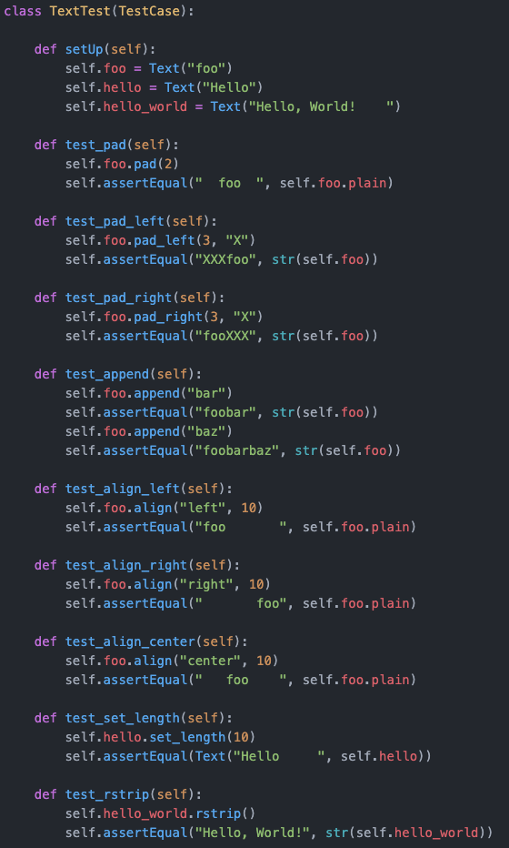

# Teste de Regressão garante que alterações não introduzam comportamentos inesperados ou novos erros.

Escolha uma opção:
- Verdadeiro <
- Falso

# Testes de unidade devem ser executados de forma rápida e frequente. Desenvolvedores devem rodar os testes unidades sempre depois de toda alteração no código pois, caso alguma regressão tenha sido inserida, o feedback será quase que imediato.

Escolha uma opção:
- Verdadeiro <
- Falso

# Testes de unidade devem ter sempre o mesmo resultado (ou eles sempre passam ou eles sempre falham). Ou seja, testes de unidade devem ser determinísticos.

Escolha uma opção:
- Verdadeiro <
- Falso

# Testes Flaky possuem resultados não-determinísticos.

Escolha uma opção:
- Verdadeiro <
- Falso

# Testes Flaky são muito raros e sua resolução é trivial.

Escolha uma opção:
- Verdadeiro
- Falso <

# Testes devem expressar o comportamento testado de forma clara.

Escolha uma opção:
- Verdadeiro <
- Falso

# Falhas inesperadas podem ter valor, pois revelam relacionamentos implícitos no código.

Escolha uma opção:
- Verdadeiro <
- Falso

# Código de teste é tão importante quanto de produção.

Escolha uma opção:
- Verdadeiro <
- Falso

# A seguinte estrutura é comum em métodos de teste: setup/execute/verify/teardown.

Escolha uma opção:
- Verdadeiro <
- Falso

# É uma boa prática nomear métodos de testes de acordo com o método que está sendo exercitado.

Escolha uma opção:
- Verdadeiro <
- Falso

# É uma boa prática de testes:

Escolha uma:
- a. Escrever testes fáceis de entender e manter. <
- b. Escrever testes com lógica condicional para cobrir vários cenários.
- c. Escrever testes com pelo menos 10 comandos asserts.
- d. Escrever testes longos para simplificar o processo de criação dos testes.
- e. Escrever testes com duplicação.

# Sobre teste de unidade e integração, marque a alternativa CORRETA:

Escolha uma:
- a. Testes de unidade testam unidades de modo dependente.
- b. Testes de integração podem envolver diversas classes ou pacotes distintos, e exercitam um serviço completo do sistema. <
- c. Testes de unidade podem ser rodados de forma automatizada ou manual.
- d. Testes de integração são mais rápidos que os testes de unidade.
- e. Testes de integração necessitam de frameworks especiais para serem rodados.

# Considerando o teste abaixo, responda:

1. Qual o tipo de teste apresentando no código (de acordo com pirâmide de testes)? 

2. Justifique as razões para a escolha do teste (com base no código).

3. Qual a fixture do teste?

4. Quantas vezes a fixture será executada?

