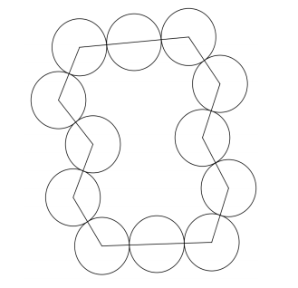
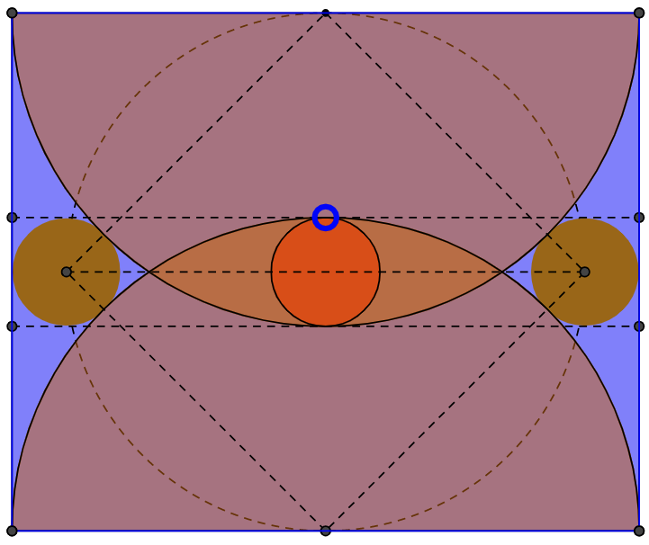
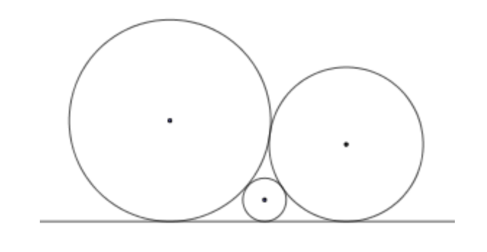

# Felipe Cadar Chamone - 2016006417

## Contexto:

**Sangaku** ou **San Gaku** são problemas ou teoriemas geométricos japoneses desenhados em tábuas de madeira (Ema) e colocados como oferendas em templos durante o período Edo.

Durante esse período o Japão aplicou regulações de comércio que proibia relações com naçoes ocidentais, então essas tábuas foram criadas usando apenas a matemática japonesa, dessenvolvida em paralelo com a matemática ocidental. Por exemplo, a coneção entre a integral e suas derivada (teorema fundamental do calculo) era desconhecida. Os problemas Sangaku em áreas e volumes eram resolvidos com expanção de series infinitas.

## Questão 1

Este problema foi extraído da coleção Suri Shinpen- Matemática dos santuários e Templos, de Saito Gigi (1816- 1889). Nele constata-se que os centros de um colar de círculos de raio “r” são vértices de um polígono de “n” lados, como mostrado na figura abaixo. Sendo "S1" e "S2" a soma das áreas dos setores circulares interiores e exteriores ao polígono,
respectivamente, mostre que "S2 - S1 = 2 PI r^2".

# Questão 2

Determine a proporção dos lados do retângulo quando os 3 circulos possuem o mesmo raio.

# Questão 3

Qual é a relação entre os raios de três círculos simultaneamente tangentes entre si
e todos eles tangentes a uma mesma reta, como na figura a seguir?

