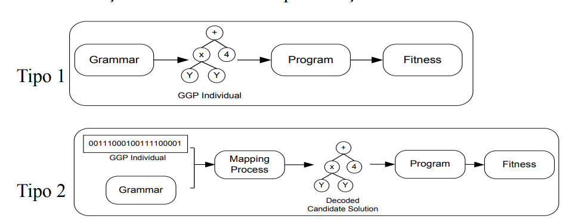
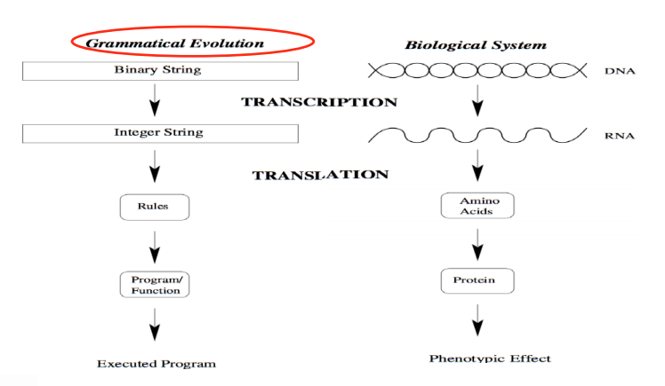

# Programação Genética Baseada em Gramáticas

## Introdução

A dificuldade de garantir o fechamento das funções, surgiram vertentes dentro da GP

1. GP restrito a sintaxe
2. GPs baseados em gramáticas

## GP Restrito a Sintaxe

Cada nó possui um tipo de entrada e saída.

Função | Tipo Entrada | Tipo Saída
-------|:--------------:|------------ 
+,-,*,/|(real, real)  | real
>, <   |(real, real)  | bool
AND, OR|(bool, bool)  | bool

Devos respeitar essses tipos nas operações.

## GP baseados a gramática

Além de garantir o fechamento, eles incorporam o espaço de busca domínio sobre o problema

A gramática pode incorporar algum conhecimento prévio.

Temos diferentes representações, basicamente em árvore e linear.



### Tipo 1

Gramática possui 3 conjuntos:
1. Terminais
2. Não Terminais
3. Símbolo Inicial

Entao usamos as regras de produção para produzir a população inicial.

Nos operadores genéticos, todos os indivíduos resultantes deve respeitar a gramática. Isso faz com que o crossover não tenha poder destrutivo.

### Tipo 2

Tenta aproxima o mapeamento do Genótipo pro Fenótico a um processo biológico.



A primeira transcição possui degeneração genética, isso significa que mais de uma **códon** podem gerar a mesma regra da gramática.

Códon é um trecho do genótipo que vai ser transcito para uma regra. Derivamos a árvore em profundidade

Gramática:
```
<code> ::= <line> | (0)
           <code> <line> | (1)
```

Códon | Regra
------|-------
0001</br> 0011</br> 0101</br> 0111 | 0
0000</br> 0010</br> 0100</br> 0110 | 1

`0001 0000 0010 0111` se traduz para `0 1 1 0`


Se chegarmos ao fim sem terminais, usamos o **wrapping**, que é reaproveitar o código genético. 

A Degeneração implica em mutações neutras. Mutaçoes que não geram alteração no fenotipo.

Trabalha com vetores de número de bits variados e estipula a quantidade máxima de códons por indivíduo.

Aqui temos um operador genético extra que é a duplicação de Códons. Que é selecionar um códon aleatório e duplica-lo antes do último códon.

Principais caracteiticas:
1. Separa genótipo de fenótipo
2. Degenração de código genético
   1. Ajuda a manter diversidade
   2. Ajuda a preservar funcionalidades
3. Operadir Wraooing
   1. Reusar código genetico

Críticas:
1. Não exite semantica no cruzamento
   1. Trocamos bits que não fazem referência a gramática
   2. wrap intensifica o efeito do cruzamento
2. Não existe localidade nos operadores.

# Dúvidas:

Como o Wrapping funciona: Quando o vetor termina mas ainda temos coisas pra derivar

# Questoes erradas:

## 1

A programação genética baseada em gramáticas com representação por árvore é idêntica à programação genética padrão, sendo necessário apenas substituir os conjuntos de terminais e funções por uma gramática.

**Resposta**

Os operadores de mutação e cruzamento também devem ser modificados para garantir que os indivíduos gerados respeitem as regras de produção da gramática.

A resposta correta é 'Falso'.


