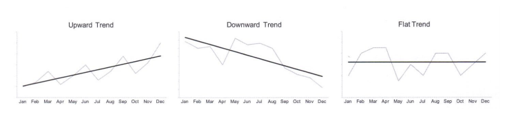
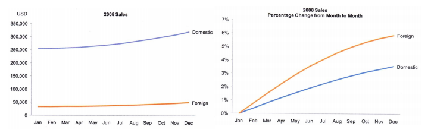

<h1>Séries Temporais</h1>

#  1. Intro

Séries temporais são muito populares, e ocupam cerca de 75 % dos gráficos em jornais internacinais.

Padrões Analíticos:
1. Tendência
2. Variabilidade
3. Taxa de mudança
4. Covariação
5. Ciclos
6. Exceções

#  2. Tendencia

Evidencia crescimento, decrecimento ou contância. É útil quando existe muita variabilidade

#  3. Variabilidade

Útil para saber se os dados variam muito. [Alta/baixa variabilidade]

#  4. Taxa de mudaça

Muitas vezes é díficil ver a a taxa de mudança nos dados, então podemos evidencia-la como o percentual de difereça entre os valores referentes a diferentes períodos de tempo.

#  5. Ciclos

Facilitar a visualização de dados sazonais. Utiliza gráficos que facilitam isso, como gráficos de radar ou gráficos de estrela.

##  5.1. Padrões analíticos

Cíclos são padrões repetidos em intervalos regulares

Valores que saem da faixa de valores normais são fáceis de identificar.

#  6. Representações visuais

##  6.1. Gráficos de Linha

Linhas e pontos: Focado em comparar ponstos específicos entre dados

##  6.2. Gráficos de barras

O comprimento das barras prove uma comparação precisa entre valores individuais.

**Desvantagem**: Difícil de ver a forma e a tendencia dos dados, os contrário do gráfico de linhas

##  6.3. Gráficos de Radar

Destaca o comportamento sazonal. Útil quando sabemos o tamanho do ciclo.

Muitas séries deixa o gráfico confuso.

##  6.4. Mapa de Calor

Úteis na representação de uma grande quantidade de dados cíclocos sem o problema de _overplotting_.

Não é muito preciso por usar escalas de cores. Mas podemos usar a interatividade dos meios digitais para resolver isso.

##  6.5. Box Plots

Bom para visualizar como as distribuições variam no tempo. Podemos usar um linha de tendência para auxiliar.

## 6.6. Gráfico de Dispensão (scatterplot)

Podemos usar gráficos scatter com animação para representar os dados, mas não é muito efetivo pela limitação de memória.

Podemos tentar resolver o problema da memória deixando uma trilha nos pontos, mas isso deixa os dados muito densos. Outra solução é usar as trilhas mas dividir os pontos em pequenos gráficos usando pequenos multiplos para visualizar cada ponto independentemente.

# 7. Boas Práticas

1. Te cuidado ao fazer recortes temporais para não passar uma impressão errada.
2. É importante comparar os dados com valóres médios, médias móveis e tendências. Bom para dar contexto aos valores absolutos.
3. Valores ausentes: Ideal deixar vazio ou colocar uma linha bem fininha para mostrar que esse dado não existe
4. Aspect Ratio: Cuidado para não usar a razão para influenciar na inclunação das linhas. 45° em média é uma boa opção.
5. Usar escalas logarítmicas em taxas de crescimento.
6. É bom fixar um ponto de referencia no tempo para facilitar a comparação. Isso depende da mensagem que se quer passar.
7. Faz sentido identificar os ciclos e mostrar um plot específico de cada ponto do ciclo (Cycleplots)
8. Comparar valores absolutos com valores cumulativos
9. Faz sentido deslocar eixos para favorecer correlações
10. Empilhar gráficos de unidades de medidas diferentes pode facilitar identificar correlações (não significa colocar no mesmo plot, mas literalmente empilhar diferentes plots)
11. Expressar tempo em percentual para comparar séries de durações diferentes

# 8. Problemas

- Quando os dados não são igualmente espaçados não devemos conecta-los por linhas. Isso pode trazer uma falsa estabilidade.

# Referencias

1. [Cycloplots](https://www.perceptualedge.com/articles/guests/intro_to_cycle_plots.pdf)
2. [COVID data](https://www.worldometers.info/coronavirus/country/brazil/)
3. [Multi-Scale Banking to 45 Degrees
](https://ieeexplore.ieee.org/abstract/document/4015420?casa_token=3tK4jitXQUQAAAAA:Jlr32hnzsB-kd01m7QMimwDWrdhv_4jV31nnD-tbRlL_8or8jkiyiDjAwxQYQjDseS1L73n16OYA)
4. [Effectiveness of Animation in Trend Visualization
](https://ieeexplore.ieee.org/abstract/document/4658146?casa_token=HM8rS9ZgqO4AAAAA:vje6g8lBIzJ8m47caIQGwEoztJd4t4VFK6BFFWuonI-pJ0yyX_lhJ2m9DzazjFv9lrtkt46uN63i)