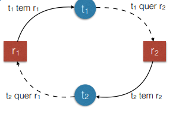
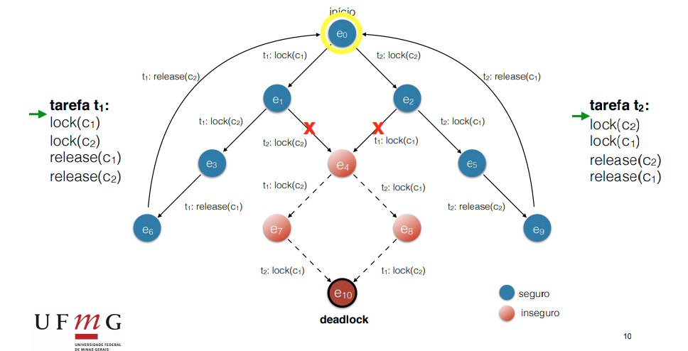

# Deadlock

Temos várias tarefas, mas nenhuma delas evoluem pq elas dependem umas das outras.

É bem representado no jantar os filósofos quando todos pegam o garfo da direita ao mesmo tempo.

# Condições para um impasse

1. Exclusão mútua
3. Posse-e-Espera:
   1. Posso ter alguns recursos alocados e esperar que mais recursos estejam disponíveis
4. Ausência de preempção
   1. Depois que eu consegui exclusão mútua, não tem nenhuma fora de perde-lo por forças externas
5. Espera circular
   1. Cada tarefa possui algo que a outra tem.
   - 

# Tratamento

Como lidar ?
1. Prevenir
2. Impedir
3. Detectar e corrigir

## Prevenir

Evitar que as quatro condições aconteçam simultaneamente.

1. Exclusão mútua:
   1. restringir controle de um recurso a uma tarefa apenas
2. Posse-e-espera
   1. forçar as tarefas a pedir todos os recursos de uma vez só
3. Ausência de preempção
   1. Perminitir preempção
4. Espera circular
   1. Garantir que a ordem de travamentos não crie ciclos

Em geral, nas memórias compartilhadas, só 2 e 4 funcionam.

### Exemplos:

#### Não permitir Posse-e-espera (Solução do saleiro)

```C
int N = 6; // N Filosofos e Hashis
semaphore saleiro, hashi[N]; // todos iniciam com 1


task filosofo(int i){ // filosofo i (entre 0 e N-1)
    while(1){
        meditar();
        down(saleiro); // <----- Só um de cada vez pode pegar talheres
        down(hashi[i]);
        down(hashi[(i+1) % N]);  // Estrutura circular
        up(saleiro); // <----- Só deixa travar os dois hashis se o saleiro estiver liberado
        comer();
        up(hashi[i]);
        up(hashi[(i+1) % N]);  // Estrutura circular
    }
}
```

#### Espera Circular: Inverter a ordem das travas

```C
int N = 6; // N Filosofos e Hashis
semaphore hashi[N]; // todos iniciam com 1


task filosofo(int i){ // filosofo i (entre 0 e N-1)
    while(1){
        // Troca a ordem dos hashis do ultimo filósofo
        first = min(i, (i+1) % 5)
        second = max(i, (i+1) % 5)

        meditar();
        down(hashi[first]);
        down(hashi[second]);  // Estrutura circular
        comer();
        up(hashi[first]);
        up(hashi[second]);  // Estrutura circular
    }
}
```

## Impedir um impasse

A evolução do sistema deve ser acompanhada. Rotular estados como seguros e inseguras. Inseguras são estados que não se pode garantir que não vai ter deadlock, então são bloqueadas antes de acontecer.

Podemos usar o algoritmo do banqueiro



## Detecção

Periodicamente fazer uma vigia que verifica se o estado do sistema infica um impasse (deadlock). Se detectado temos que:
1. Liberar recursos à força
2. Matar processos envolvidos

Pode ser útil se as outras opção forem muito complicadas para o problema.