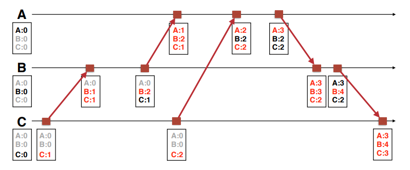
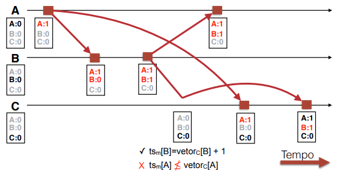

# Vector Clock

O relógio lógico não mantem histórico das interações. Um processo não tem noção de como o seu relógio se comporta em relação aos outros.

## Ordem total x Ordem Causal

Ordem total exige comunicação frequente e impõe restrições sobre o que se pode executar em cada instante.

Ordem causal deixa que eventos não relacionados sejam executados em qualquer ordem, e apenas os eventos relacionados devem manter a ordem.

## Relógio vetorial (Vector Clock)

Cada nó mantem um vetor de contadores com a sua visão mais recente do relógio de cada outro nó

Dado o vetor Vi do processo i:
1. Quando o processo **i** executa, incrementa o vetor Vi[i]
2. Quando o processo **i** envia uma mensagem, inclui o vetor Vi nela
3. Quando o processo **i** recebe uma mensagem do nó **j**
   1. Atualiza seu vetor: Vi = max(Vi[k], Vj[k]), para **k** diferente de **i**
   2. Incrementa seu próprio relógio, Vi[i] += 1

Dado dois eventos A e B:
1. Se todos os valores do vetor de A são maiores que B, então A ocorreu depois que B.
2. Se nem todos os valores são maiores ou menores, não podemos definir relação de ordem entre A e B.

## Causal-Ordered Multicasting

Todas as mensagens são enviadas por multicast

1. O valor de Vi[i] só é incrementado no envio de mensagens
2. uma mensagem do processo **i** e mantida na file de entrega do processo **j** até que:
   1. O contador da mensagem Vi[i] sejá igual ao meu Vj[i] + 1. A mensagem é a próxima da fila do processo **i** dentro do processo **j**.
   2. Para os outros processos, o valor de Vi[k]

