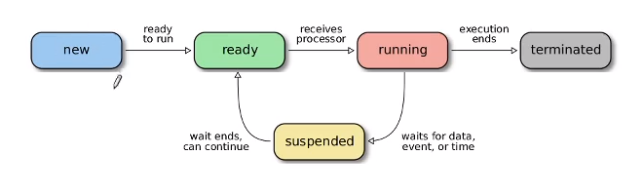
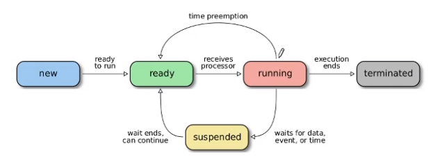

# Gestão de tarefas - O conceito de tarefa

Um **programa** é uma sequencia de instruções para tratar um problema. É um conceito **estátido**, a não ser que você altere o código, recompile e o execute de novo.

Uma **tarefa** é a execução das instruções do progra. Ela é a atividade. Conceito **Dinâmico**, ela evolui. Podem ser implementadas como **Processos**, **Thereads** e outros...

Podemos ter duas tarefas distintas executando um mesmo programa.

## Sistemas Monotarefas

Sistemas que executam uma tarefa de cada vez.

Cada terefa tem 3 estados possíveis:
- **New**: Tarefa está sendo criada. Está sendo carregada na memória.
- **Running**: Rodadando até o final da execução
- **Terminated**: Dados são recuperados e mostrados ao usuário e ela deixa de existir

**Problemas**: Se uma tarefa está esperando por algum input do usuário ela continua em Running, então nenhuma outra tarefa pode aproveitar esse tempo pois o sistema só roda uma tarefa de cada vez.

## Sistemas Multitarefa

Resolve o problema anterior. Carregamos várias tarefas na memória e quando uma delas para, colocamos outra em execução.

Temos um monitor que gerencia o estado das tarefas.

Agora temos mais estados:
- **New**: Criação da tarefa.
- **Ready**: Tarefa pronta pare ser executada.
- **Running**: Tarefa sendo executada.
- **Suspended**: Tarefa esperando por algum dado.
- **Terminated**: Tarefa encerrada ou abortada.

 
**Problemas**:
- Aplicações de loop infinito travam todo o sistema.
- Aplicações interativas não funcionam bem por perderam muita prioridade.

## Sistemas de tempo compartilhado

Preempção por tempo. "Arrancar" o recurso por tempo.

Tarefas recebem fatias de tempo que podem ocupar a CPU. Depois de determinado tempo ela volta pra fila do gerenciador no estado "*ready*". Implementamos isso com interrupções de tempo.

**Implementação (mais simples)**: A cada *tick* do clock, o hardware dispara uma interrupção de tempo. Então o código da interrupção verifica se a tarefa atual já excedeu eu tempo de CPU, caso sim ela coloca a tarefa atual como "*ready*" e retorna o controle para o kernel escolher a próxima tarefa.

